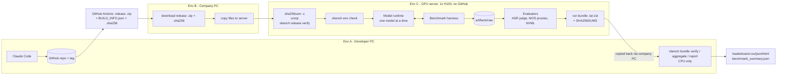
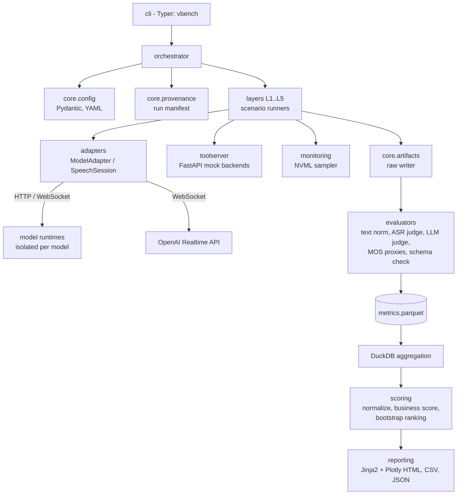
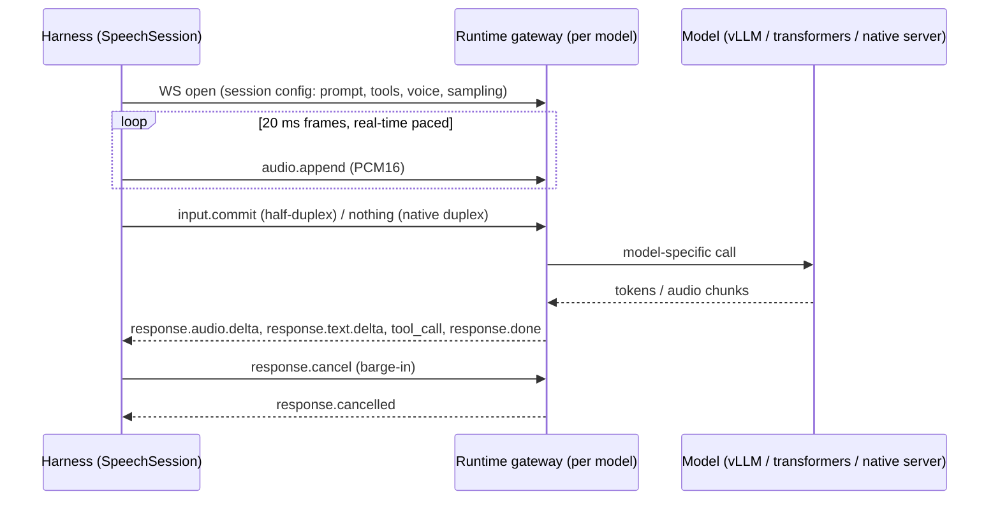
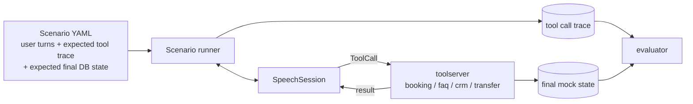

# Kiến trúc — Benchmark Speech-to-Speech cho Tổng đài AI tiếng Nhật

| Trường | Giá trị |
|---|---|
| Trạng thái | **ĐÃ DUYỆT** (2026-09-21). v0.2.0: GPU server không có Docker, phục vụ model bằng vLLM trong `uv` venv riêng cho từng model. v0.3.0 (2026-09-22): GPU server không kết nối GitHub, code được đưa lên bằng gói release offline |
| Phiên bản | 0.4.0 (2026-09-22: model OSS đầu tiên chạy qua vLLM-Omni realtime API, §6.1) |
| Ngày | 2026-09-21 |
| Phạm vi | Framework benchmark cho các mô hình Speech-to-Speech (S2S) bản địa, bài toán tổng đài tiếng Nhật |

> Bản tiếng Việt. Tên metric, lệnh CLI, đường dẫn, tên trường cấu hình và code giữ nguyên tiếng Anh để khớp với source code.

---

## 1. Mục tiêu và Ngoài phạm vi

### 1.1 Mục tiêu

1. So sánh 6 mô hình S2S mã nguồn mở và 1 baseline thương mại trong điều kiện **giống hệt nhau, có thể tái lập**.
2. Bao phủ 5 lớp: năng lực tiếng Nhật, giọng nói thời gian thực, gọi công cụ (tool calling), chất lượng giọng nói, hạ tầng & TCO.
3. Tạo **bảng xếp hạng theo góc nhìn kinh doanh** (trọng số 35/25/15/15/10) **chỉ từ kết quả đo thực tế**.
4. Mọi con số đều truy vết được: đo như thế nào, dữ liệu nguồn, thời điểm, phiên bản model, phiên bản code.
5. Hỗ trợ mô hình vận hành có con người tham gia (human-in-the-loop): code được viết trên máy không có GPU, con người chạy trên GPU server, kết quả được gửi lại để phân tích.

### 1.2 Ngoài phạm vi

- Huấn luyện hoặc fine-tune model.
- Xây dựng hệ thống tổng đài production. Các backend cho tool calling là **mock** có tính tất định (deterministic).
- Tìm model mạnh nhất về mặt nghiên cứu. Câu hỏi cần trả lời là "model nào triển khai được tốt nhất cho tổng đài tiếng Nhật với ngân sách phần cứng hiện có".
- Tạo ra bất kỳ con số nào khi chưa có lần chạy thực tế. Framework không bao giờ ước lượng, ngoại suy hay tự điền (impute) giá trị metric.

---

## 2. Ràng buộc cứng

| # | Ràng buộc | Hệ quả kiến trúc |
|---|---|---|
| C1 | Máy dev (Env A) không có GPU để benchmark | Mọi thứ ngoài inference của model phải chạy được trên CPU. Adapter `mock` cho phép test end-to-end không cần GPU. Chấm điểm/báo cáo chạy trên Env A từ artifact được gửi về. |
| C2 | GPU server (Env C) do con người vận hành, không phải Claude | Việc thực thi được đóng gói thành một số ít lệnh CLI kèm bước kiểm tra trước (preflight). Kết quả được gom vào một file nén kèm checksum để gửi về. |
| C3 | 1x H100 80GB | Benchmark **từng model một**. Không bao giờ có hai model cùng nằm trên GPU (trừ ASR/judge dùng để chấm, được nạp ở một giai đoạn riêng). |
| C4 | SSD 300GB, được dùng 200GB | Weights của model được tải, benchmark rồi xoá theo từng model. Dataset lưu audio gọn (FLAC mono 16 kHz / 24 kHz). Artifact thô được lọc/nén theo từng run. Kiểm tra dung lượng đĩa là một phần của preflight. |
| C5 | Các model có thư viện Python xung đột nhau | Mỗi model chạy trong **`uv` virtual environment riêng** (GPU server không có Docker) sau một giao thức mạng thống nhất. Harness không bao giờ import code của model. |
| C7 | GPU server không kết nối được GitHub; code chỉ đến server bằng cách copy file từ máy công ty (hai chiều copy được mọi loại file); server vẫn truy cập PyPI, Hugging Face, OpenAI | Code được phát hành dưới dạng **gói release offline** (`.zip` + `.zip.sha256`) do GitHub Actions build từ một tag. `BUILD_INFO.json` trong gói ghi commit và SHA-256 từng file, thay cho `.git` làm nguồn truy vết trên server (§9.4). |
| C6 | Không bịa kết quả / nhãn | Giá trị metric chỉ đến từ các `MetricRecord` do evaluator tính từ artifact thô. Thiếu dữ liệu = `null` kèm lý do, không bao giờ là 0 hay giá trị đoán. Dữ liệu synthetic được gắn cờ. Run mock không bao giờ được đưa vào leaderboard. |

---

## 3. Bối cảnh hệ thống



Pipeline được tách để **chỉ inference và phần chấm điểm cần GPU** chạy trên Env C. Tổng hợp, chấm điểm và báo cáo là code CPU có tính tất định, chạy lại được ở bất kỳ đâu từ bundle gửi về. Nhờ đó có thể phân tích và chấm điểm lại mà không phải chạy lại workload GPU.

---

## 4. Các giai đoạn của pipeline

Mọi lần chạy benchmark đi qua năm giai đoạn. Mỗi giai đoạn chỉ đọc đầu ra của giai đoạn trước từ đĩa, nên có thể chạy lại độc lập từng giai đoạn.

| Giai đoạn | Chạy ở đâu | Đầu vào | Đầu ra | Cần GPU? |
|---|---|---|---|---|
| **1. Prepare** (chuẩn bị) | Env C | mục đăng ký model, manifest dataset | weights đã tải + kiểm tra, runtime sẵn sàng, audio dataset đã tạo + checksum | không (mạng/đĩa) |
| **2. Collect** (thu thập) | Env C | model server đang chạy, dataset, cấu hình run | `artifacts/raw/<run_id>/…`: audio phản hồi, text, tool call, timeline sự kiện, mẫu NVML | có |
| **3. Evaluate** (chấm) | Env C (evaluator cần GPU) hoặc Env A (evaluator CPU) | artifact thô | `artifacts/processed/<run_id>/metrics.parquet` gồm các `MetricRecord` | một phần |
| **4. Aggregate & Score** (tổng hợp & chấm điểm) | bất kỳ | một hoặc nhiều run đã xử lý | điểm từng lớp theo model, business score, xếp hạng kèm khoảng tin cậy | không |
| **5. Report** (báo cáo) | bất kỳ | kết quả tổng hợp | báo cáo HTML/JSON từng lớp, `leaderboard.*`, `benchmark_summary.json`, dashboard | không |

Điểm MOS do người chấm (Lớp 4) được đưa vào ở Giai đoạn 3 như một đầu vào bổ sung, lưu trong `datasets/human_reviewed/`.

---

## 5. Kiến trúc thành phần



### 5.1 Cấu trúc repository

```text
benchmark/                      # Python package (import name: benchmark)
  cli.py                        # Typer app, entry point `vbench`
  core/
    config.py                   # Pydantic settings + YAML loading, env var overrides
    schemas.py                  # shared Pydantic models (MetricRecord, RunManifest, ...)
    provenance.py               # run_id, git sha, config hash, env capture
    artifacts.py                # artifact path layout, atomic writers, checksums
    logging.py                  # structlog JSON logging
    clock.py                    # monotonic timestamp helpers
    registry.py                 # model / dataset / layer registries
  adapters/
    base.py                     # ModelAdapter, SpeechSession, ModelEvent, capabilities
    mock.py                     # deterministic CPU adapter for tests (never rankable)
    openai_realtime.py          # GPT-Realtime baseline
    qwen3_omni.py
    minicpm_o.py
    step_audio.py
    glm4_voice.py
    llama_omni2.py
    baichuan_omni.py
  runtimes/                     # per-model serving wrappers (run inside isolated env)
    <model>/pyproject.toml, uv.lock, server.py, launch.sh   # one isolated uv venv per model
  audio/
    io.py, resample.py, vad.py, streamer.py (real-time paced sender), mixer.py (barge-in injection)
  layers/
    layer1_japanese/            # ASR, understanding, intent/slot, keigo, long context
    layer2_realtime/            # TTFA, interrupt, barge-in, turn taking, duplex, stability
    layer3_toolcalling/         # booking, FAQ, CRM, transfer, structured output
    layer4_voice/               # MOS proxies, consistency, human MOS export/import
    layer5_infra/               # VRAM, throughput, concurrency sweep, cost/TCO
  toolserver/                   # FastAPI mock tools with deterministic state
  evaluators/
    ja_text.py                  # Japanese normalization, tokenization, CER/WER
    asr_judge.py                # transcribe model output audio
    llm_judge.py                # rubric-based judge, versioned prompts
    mos_proxy.py                # UTMOS/DNSMOS-style automatic predictors
    speaker.py                  # speaker-embedding consistency
  monitoring/
    nvml.py                     # GPU sampler (pynvml)
  scoring/
    normalize.py                # metric -> [0,1] via fixed anchors
    business.py                 # 35/25/15/15/10 aggregation
    ranking.py                  # bootstrap CIs, rank stability
  reporting/
    templates/                  # Jinja2 HTML templates
    layer_reports.py, leaderboard.py, summary.py
  annotation/
    mos_app.py                  # Gradio app for blind human MOS rating
configs/
  models/<model>.yaml           # model registry entries
  runs/<profile>.yaml           # smoke / standard / full run profiles
  prompts/ja/*.yaml             # versioned system prompts and judge rubrics
  scoring/anchors.yaml          # normalization anchors and SLOs
  cost/pricing.yaml             # GPU $/h, API prices (user-supplied, with source + date)
datasets/
  <dataset_name>/<version>/manifest.jsonl, DATASHEET.md, build.py
  human_reviewed/<dataset_name>/<version>/...
artifacts/{raw,processed,reports,dashboards}/   # git-ignored except .gitkeep
scripts/                        # server helper scripts (bash), bundle, prune
tests/                          # pytest, CPU-only, >= 80% coverage
docs/
.github/workflows/              # CI: lint, type check, tests, coverage
```

---

## 6. Tích hợp model

### 6.1 Cô lập: mỗi model một runtime

7 model mục tiêu dùng framework, phiên bản thư viện và cách phục vụ khác nhau. Vì vậy harness **không bao giờ import code của model**. Mỗi model OSS chạy trong `uv` venv riêng tại `$VBENCH_HOME/runtimes/<model>/.venv` (GPU server không có Docker) và mở một **Model Gateway Protocol** mỏng qua localhost. Harness giao tiếp với mọi model theo cùng một cách.

**Chính sách backend phục vụ model (đã chốt khi review):**

1. **vLLM là engine mặc định.** Nếu vLLM (hoặc bản mở rộng omni/audio chính thức của vLLM, nếu model card yêu cầu) hỗ trợ model, runtime sẽ chạy vLLM như một process cục bộ và gateway (`server.py`) bọc bên ngoài.
2. **Phương án dự phòng — code inference chính thức.** Nếu phần xử lý audio của model (ví dụ speech decoder / talker / vocoder) không được vLLM hỗ trợ ở phiên bản vLLM đã chốt, runtime dùng code inference chính thức của model trong cùng venv. Việc này được quyết định cho từng model ở Phase 2/9 dựa trên smoke test, ghi vào trường `runtime.engine` trong YAML của model, và hiển thị trong mọi báo cáo, vì lựa chọn engine ảnh hưởng đến độ trễ và throughput.
3. Phiên bản vLLM được chốt theo từng runtime (`uv.lock`); phiên bản `vllm` / `torch` / CUDA được ghi vào run manifest.
4. Weights được tải trực tiếp từ Hugging Face trên GPU server (chốt `revision`), vào `$HF_HOME` trên SSD benchmark.



**Cập nhật Phase 2 (2026-09-23):** đo thực tế cho thấy `/v1/realtime?duplex=0` của vLLM-Omni là API chép lời của vLLM upstream (không nhận system prompt, tool hay lệnh huỷ). Vì vậy harness có **hai kênh**: `transport: chat` (`/v1/chat/completions`, dùng cho các lớp chấm điểm theo lượt) và `transport: realtime` (WebSocket, dùng cho thời gian thực/duplex ở Phase 6 và cho GPT-Realtime). Chi tiết: `docs/REALTIME_PROTOCOL.md` §0.

**Cập nhật Phase 2 (2026-09-22):** vLLM-Omni 0.28 đã có sẵn WebSocket `/v1/realtime` theo event của OpenAI Realtime cho Qwen3-Omni và MiniCPM-o 4.5. Với hai model này, harness nói chuyện trực tiếp với vLLM-Omni, không cần gateway riêng; gateway chỉ cần cho các model vLLM-Omni không hỗ trợ (Phase 9). Chi tiết event: `docs/REALTIME_PROTOCOL.md`. Hai model dùng chung một venv `vllm_omni_0_28` (vllm==0.28.0, vllm-omni==0.28.0, Python 3.12).

Giao thức được thiết kế có chủ đích theo cấu trúc event của OpenAI Realtime API, để baseline thương mại và các model OSS dùng chung một bộ từ vựng event. Với mỗi model OSS, gateway (`runtimes/<model>/server.py`) dịch giao thức này sang API inference gốc của model.

### 6.2 Giao diện adapter (phía harness)

```python
class ModelCapabilities(BaseModel):
    native_full_duplex: CapabilityStatus      # claimed / verified / unsupported / unknown
    streaming_audio_output: CapabilityStatus
    native_tool_calling: CapabilityStatus
    text_output_channel: CapabilityStatus
    max_context_tokens: int | None
    input_sample_rate_hz: int
    output_sample_rate_hz: int

class SpeechSession(Protocol):
    async def send_audio(self, chunk: AudioChunk) -> None: ...
    async def commit_input(self) -> None: ...
    async def cancel_response(self) -> None: ...
    async def send_tool_result(self, call_id: str, result: dict[str, Any]) -> None: ...
    def events(self) -> AsyncIterator[ModelEvent]: ...
    async def close(self) -> None: ...

class ModelAdapter(Protocol):
    model_id: str
    capabilities: ModelCapabilities
    async def health(self) -> RuntimeHealth: ...
    async def open_session(self, cfg: SessionConfig) -> SpeechSession: ...
```

`ModelEvent` là một discriminated union gồm: `AudioDelta`, `TextDelta`, `ToolCall`, `ResponseDone`, `ResponseCancelled`, `Error`. **Mọi mốc thời gian đều do harness ghi khi nhận event** (`time.monotonic_ns()`), không bao giờ lấy từ giá trị model tự báo, nhờ vậy độ trễ so sánh được giữa các model.

### 6.3 Ma trận năng lực và xử lý "unsupported"

Năng lực của model (full duplex, tool calling native, streaming output, hỗ trợ tiếng Nhật) được ghi trong `configs/models/<model>.yaml` với hai trường riêng: `claimed` (nguồn là URL model card) và `verified` (chỉ được đặt bởi smoke test ở Phase 2). Kiến trúc **không** giả định model nào hỗ trợ năng lực nào.

Khi thiếu một năng lực, framework dùng một **phương án dự phòng thống nhất, có tài liệu** và gắn tag cho kết quả:

| Năng lực bị thiếu | Phương án dự phòng | Tag kết quả |
|---|---|---|
| Full duplex / barge-in native | VAD orchestrator phía harness huỷ phần đang sinh khi phát hiện người dùng nói | `mode=orchestrated` (báo cáo tách riêng với `mode=native`) |
| Tool calling native | Giao thức tool dạng JSON trong prompt (cùng một prompt template cho mọi model loại này), harness tự parse | `tool_mode=prompted` |
| Streaming audio output | Đo độ trễ của toàn bộ phản hồi; TTFA = thời gian đến khi có audio hoàn chỉnh | `streaming=false` |
| Hoàn toàn không chạy được (OOM, bản phát hành lỗi) | Không có | metric = `null`, `status=not_measured`, ghi lại lý do |

Leaderboard hiển thị các tag này cạnh điểm số để kết quả orchestrated và native không bao giờ bị trộn lẫn một cách âm thầm.

### 6.4 Mục đăng ký model (ví dụ cấu trúc)

```yaml
# configs/models/qwen3_omni.yaml
model_id: qwen3-omni-30b-a3b-fp8
display_name: Qwen3-Omni-30B-A3B (FP8)
source:
  hub: huggingface
  repo: <repo id>            # filled in Phase 2 from the official model card
  revision: <commit sha>     # pinned; never "main"
license: <SPDX or URL>       # recorded for deployment eligibility review
runtime:
  kind: venv                 # venv | remote_api
  engine: vllm               # vllm | official  (decided by Phase 2 smoke test)
  vllm_version: <pinned>
  venv_path: runtimes/qwen3_omni/.venv
  gateway_port: 18001
  launch_timeout_s: 900
capabilities:
  native_full_duplex: {claimed: unknown, verified: unknown, source: null}
  native_tool_calling: {claimed: unknown, verified: unknown, source: null}
sampling:                    # per-model defaults, recorded in run manifest
  temperature: <value from model card>
  top_p: <value>
  seed: 1234
disk_estimate_gb: null       # measured in Phase 2, not guessed
```

Baseline thương mại dùng `runtime.kind: remote_api`. Thông tin xác thực chỉ lấy từ biến môi trường (`OPENAI_API_KEY`). Tên model API và phiên bản API chính xác được chốt trong cấu hình và ghi vào mọi manifest.

---

## 7. Chế độ tương tác

Hai chế độ thực thi bao phủ mọi lớp:

| Chế độ | Dùng cho | Hành vi |
|---|---|---|
| **Turn mode** (theo lượt) | L1, L3, L4 | Gửi toàn bộ câu nói của người dùng (nhanh, không theo nhịp thời gian thực), chờ `ResponseDone`. Đo chất lượng, không đo thời gian. Dùng sampling tất định nếu model cho phép. |
| **Streaming mode** (luồng) | L2, L5 | Audio gửi theo frame 20 ms đúng nhịp thời gian thực bằng `audio.streamer`. Audio barge-in được chèn vào tại các thời điểm định sẵn bằng `audio.mixer`. Ghi toàn bộ timeline sự kiện. |

Các kịch bản nhiều lượt (nhớ ngữ cảnh dài, luồng đặt lịch) là hội thoại soạn sẵn: mỗi lượt người dùng là một file audio thu sẵn hoặc tổng hợp; lượt tiếp theo được gửi sau khi model trả lời xong (turn mode) hoặc tại thời điểm định sẵn (streaming mode). Lượt người dùng không bao giờ phụ thuộc nội dung model trả lời, nhờ đó các run so sánh được giữa các model. Hội thoại rẽ nhánh nằm ngoài phạm vi v1.

---

## 8. Thiết kế từng lớp

Công thức chính xác của từng metric xem ở `docs/METRIC_DEFINITIONS.md`. Phần này mô tả cơ chế đo.

### 8.1 Lớp 1 — Năng lực tiếng Nhật

| Metric | Cơ chế |
|---|---|
| ASR CER / WER | Prompt yêu cầu model chép lại/nhắc lại câu nói. Kênh text đầu ra (nếu có) và bản chép lời audio đầu ra do ASR judge tạo được chấm riêng. CER tính trên text đã chuẩn hoá NFKC và bỏ dấu câu; WER tính trên token MeCab (fugashi + UniDic). |
| Phân loại intent | Câu nói của khách hàng → model được yêu cầu trả nhãn intent có cấu trúc, trong tập đóng khai báo ở system prompt. Accuracy + macro-F1 so với nhãn chuẩn (gold). |
| Trích xuất slot | Cùng các câu nói, có slot chuẩn (ngày, giờ, tên, số điện thoại, sản phẩm…). Precision/recall/F1 ở mức slot sau khi chuẩn hoá giá trị (ngày về ISO, số về half-width). |
| Hiểu tiếng Nhật | Hỏi đáp trên đoạn văn tiếng Nhật dạng nói; câu trả lời dạng đóng chấm khớp chính xác, dạng mở chấm bằng LLM judge theo rubric. |
| Tuân thủ keigo | Câu trả lời bằng giọng của model → ASR judge → (a) bộ phát hiện theo luật cho các dạng thân mật bị cấm / mẫu kính ngữ bắt buộc, (b) LLM judge theo rubric keigo. Judge được hiệu chỉnh với một tập con có người gán nhãn; báo cáo độ đồng thuận (Cohen's κ). |
| Nhớ ngữ cảnh dài | Hội thoại nhiều lượt, trong đó thông tin ở lượt đầu được hỏi lại ở lượt sau. Accuracy nhớ lại theo nhóm khoảng cách lượt. |

**Kiểm soát sai lệch của evaluator.** ASR judge (ví dụ một model họ Whisper, chốt phiên bản) dùng chung cho mọi model, và cũng được chạy trên audio *tham chiếu* để báo cáo mức lỗi nền của chính nó. LLM judge chạy với temperature 0, chốt phiên bản model và dùng prompt rubric có phiên bản; model làm judge không được là một trong các model đang benchmark.

### 8.2 Lớp 2 — Giọng nói thời gian thực

Mọi độ trễ được đo trên GPU server qua localhost (cố ý loại trừ mạng; baseline cloud có tính cả mạng và được ghi nhãn như vậy, kèm RTT đến API đo được).

| Metric | Định nghĩa (tóm tắt) |
|---|---|
| TTFA | `t(AudioDelta đầu tiên có nội dung không phải im lặng) − t(người dùng nói xong)`, trong đó thời điểm người dùng nói xong được biết chính xác từ file kích thích. Báo cáo P50/P95/P99. |
| Độ trễ ngắt lời (interrupt latency) | Audio barge-in được chèn tại thời điểm định sẵn khi model đang nói. `t(audio đầu ra của model dừng) − t(bắt đầu barge-in)`. Dừng = event huỷ hoặc ≥ N ms im lặng trong luồng đầu ra. |
| Barge-in thành công | Tỷ lệ lần barge-in mà đầu ra dừng trong SLO **và** câu trả lời tiếp theo của model xử lý đúng câu ngắt lời (LLM chấm). |
| Barge-in sai | Tiếng đệm / nhiễu ("はい", "ええ", tiếng ho) *không* được làm model dừng. Tỷ lệ dừng sai. |
| Luân phiên lượt nói | Phân bố khoảng trống giữa lượt; tỷ lệ nói chồng; trả lời sớm khi người dùng ngập ngừng giữa câu. |
| Tương tác duplex | Chỉ áp dụng khi `native_full_duplex=verified`; ngược lại báo là `unsupported`. |
| Ổn định hội thoại dài | Cuộc gọi soạn sẵn 10–30 phút: độ trôi TTFA theo thời gian, tỷ lệ lỗi/crash, mức tăng VRAM, độ trôi chất lượng câu trả lời (kiểm tra L1 ở các lượt cuối). |

### 8.3 Lớp 3 — Tool calling



- **Định nghĩa tool** là JSON Schema dùng chung cho mọi model (function calling native nếu đã verified, ngược lại dùng JSON trong prompt).
- **toolserver** là ứng dụng FastAPI có trạng thái trong bộ nhớ, tất định và đặt seed được (lịch trống, bản ghi CRM, kho FAQ, hàng đợi chuyển cuộc gọi). Reset cho từng kịch bản.
- Metric:
  - *Tool success rate*: tỷ lệ lời gọi hợp lệ theo schema và thực hiện thành công với backend.
  - *JSON accuracy*: tỷ lệ hợp lệ theo schema và tỷ lệ khớp tham số chính xác/sau chuẩn hoá so với trace kỳ vọng.
  - *Hallucinated tool rate*: lời gọi đến tool không tồn tại, hoặc tham số có giá trị không có căn cứ trong hội thoại hay kết quả tool trước đó.
  - *Task completion rate*: trạng thái mock cuối cùng khớp trạng thái kỳ vọng (đặt lịch đúng khung giờ, chuyển đúng hàng đợi, v.v.). Cho phép thứ tự trace khác nếu trạng thái cuối đúng.

### 8.4 Lớp 4 — Chất lượng giọng nói

| Thành phần | Cơ chế |
|---|---|
| MOS tự động (proxy) | Các bộ dự đoán MOS đã huấn luyện sẵn (chốt phiên bản). Độ tin cậy của từng bộ dự đoán với tiếng Nhật là một lưu ý rõ ràng; bộ dự đoán được hiệu chỉnh với MOS của người chấm trên một tập con và báo cáo hệ số tương quan. |
| Phát âm | CER qua vòng ASR trên các câu đọc soạn sẵn (model được yêu cầu nói đúng câu tiếng Nhật cố định có số, ngày, tên, từ vựng nghiệp vụ). |
| Chất lượng ngữ điệu (accent) | Người chấm. Proxy tự động tuỳ chọn: so sánh pitch-accent qua đường F0 với bản đọc tham chiếu (thử nghiệm, chưa đưa vào business score cho đến khi được kiểm chứng). |
| Biểu cảm | Prompt soạn sẵn yêu cầu giọng xin lỗi / đồng cảm / vui vẻ; người chấm. |
| Tính nhất quán | Độ tương đồng cosine của speaker embedding giữa các lượt và các phiên (cùng cấu hình giọng). |
| MOS của người chấm | `annotation/mos_app.py` (Gradio): chấm mù, thứ tự ngẫu nhiên, ẩn danh tính model, có clip neo/kiểm tra sự chú ý, ≥ N người chấm mỗi clip. Kết quả xuất CSV vào `datasets/human_reviewed/`. Báo cáo MOS kèm CI 95%. |

### 8.5 Lớp 5 — Hạ tầng & TCO

| Metric | Cơ chế |
|---|---|
| VRAM | Lấy mẫu NVML 10 Hz khi rảnh, khi 1 cuộc gọi, và ở từng mức đồng thời; giá trị đỉnh và ổn định. |
| GPU utilization | SM utilization từ NVML, cùng cách lấy mẫu. |
| Throughput | Số giây audio sinh ra trên mỗi giây đồng hồ; tokens/s nếu model cung cấp. |
| Số cuộc gọi đồng thời | Quét mức đồng thời N = 1, 2, 4, 8, … cuộc gọi streaming. **Số cuộc gọi đồng thời tối đa** = N lớn nhất mà TTFA P95 ≤ SLO và tỷ lệ lỗi ≤ SLO (SLO trong `configs/scoring/anchors.yaml`). |
| Chi phí mỗi phút | `gpu_hourly_cost / (60 × max_concurrent_calls_at_SLO)` với OSS; lượng token sử dụng × giá cấu hình với baseline API. |
| Chi phí mỗi cuộc gọi | Chi phí mỗi phút × thời lượng cuộc gọi trung bình đo được của bộ kịch bản chuẩn. |
| TCO | Mô hình cấu hình được (khấu hao phần cứng hoặc thuê cloud, điện, chi phí vận hành, lưu lượng gọi mục tiêu). Mọi giá đầu vào do **người dùng cung cấp** trong `configs/cost/pricing.yaml` kèm `source` và ngày `as_of`; framework không bao giờ tự giả định giá. |

---

## 9. Mô hình dữ liệu và truy vết

### 9.1 Run manifest

Được ghi khi bắt đầu mỗi run (`artifacts/raw/<run_id>/manifest.json`) và hoàn tất khi kết thúc.

```python
class RunManifest(BaseModel):
    run_id: str                  # ULID, time-sortable
    profile: str                 # smoke | standard | full
    is_mock: bool                # True => can never be ranked
    started_at: datetime         # UTC
    finished_at: datetime | None
    git_commit: str              # commit from git, or from BUILD_INFO.json of a release package
    git_dirty: bool              # dirty => code differs from that commit; run is non-rankable
    source_kind: str             # git | release | unknown
    release_name: str | None     # e.g. ai-callcenter-benchmark-0.1.1-448a82fa
    config_sha256: str           # hash of fully resolved config
    model: ModelVersion          # model_id, repo, revision sha, engine, engine version, runtime uv.lock sha256
    datasets: list[DatasetRef]   # name, version, manifest sha256
    environment: EnvInfo         # host, GPU name, driver, CUDA, python, key package versions
    seeds: dict[str, int]
    layers: list[str]
    status: Literal["running", "completed", "failed", "partial"]
```

### 9.2 Metric record

Mọi con số xuất hiện trong bất kỳ báo cáo nào đều truy ngược được về một hoặc nhiều `MetricRecord`.

```python
class MetricRecord(BaseModel):
    run_id: str
    model_id: str
    model_revision: str
    layer: Literal["L1", "L2", "L3", "L4", "L5"]
    metric: str                  # e.g. "l2.ttfa_ms"
    sample_id: str | None        # None for aggregate records
    value: float | None          # None => not measured
    unit: str
    status: Literal["measured", "not_measured", "unsupported", "error"]
    reason: str | None
    method: str                  # evaluator name + version, links to METRIC_DEFINITIONS.md
    source_files: list[str]      # raw artifact paths relative to run dir
    measured_at: datetime
    tags: dict[str, str]         # mode=orchestrated, tool_mode=prompted, ...
```

Record được lưu ở mức từng mẫu; giá trị tổng hợp được tính trong DuckDB, nên mọi giá trị tổng hợp đều tính lại và bootstrap lại được.

### 9.3 Cấu trúc artifact

```text
artifacts/
  raw/<run_id>/
    manifest.json
    logs/run.jsonl                         # structured logs
    <layer>/<sample_id>/
      input.flac, output.flac
      events.jsonl                         # harness-timestamped event timeline
      tool_trace.jsonl                     # L3 only
    monitoring/nvml.parquet
    SHA256SUMS
  processed/<run_id>/
    metrics.parquet                        # MetricRecord rows
    layer_summaries.json
  reports/<report_id>/
    layer1_japanese.{json,html}  ...  layer5_infra.{json,html}
    leaderboard.csv, leaderboard.json, leaderboard.html
    benchmark_summary.json
  dashboards/<report_id>/index.html
```

`vbench bundle create <run_id>` tạo `<run_id>.tar.zst` (event thô + metric đã xử lý + log, tuỳ chọn kèm audio) cùng `SHA256SUMS`. `vbench bundle verify` kiểm tra bundle trên Env A trước khi phân tích.

> Ghi chú Phase 1: runner hiện tại lưu audio dạng `.wav`; chuyển sang FLAC khi có module audio ở Phase 3.

### 9.4 Truy vết code trên server không có git (gói release)

GPU server không có `.git`, nên commit của code được lấy từ gói release:

1. Claude merge vào `main`, tạo tag `vX.Y.Z` và push. Workflow `.github/workflows/release.yml` chạy `vbench release build`: đóng gói các file đã commit tại tag bằng `git archive` (không lấy từ thư mục làm việc, nên nội dung giống hệt commit trên mọi hệ điều hành), thêm `BUILD_INFO.json` (package, version, release_name, commit, tag, built_at, SHA-256 từng file), và tạo `<release_name>.zip.sha256`. Workflow giải nén lại gói, chạy `vbench release verify` và toàn bộ test trên bản giải nén, rồi mới đăng lên GitHub Releases.
2. Trên server: `sha256sum -c` kiểm tra file zip; sau khi giải nén, `vbench release verify` so từng file với `BUILD_INFO.json`: báo thiếu file, file bị sửa (kể cả đổi LF → CRLF), và file lạ trong `benchmark/`, `configs/`, `datasets/`, `scripts/`, `tests/`. File sinh ra khi chạy (`.venv`, `__pycache__`, cache, audio dataset) được bỏ qua.
3. Khi bắt đầu mỗi run, `source_state()` dùng git nếu có checkout hợp lệ; nếu không thì dùng `BUILD_INFO.json` và kiểm tra lại toàn bộ file. Kết quả ghi vào manifest (`source_kind`, `release_name`, `git_commit`, `git_dirty`); các vấn đề phát hiện được ghi vào `notes`. Run có `git_dirty=true` bị leaderboard từ chối như §10.3.

`BUILD_INFO.json` và `dist/` nằm trong `.gitignore`; chúng chỉ tồn tại trong gói release.

---

## 10. Chấm điểm và xếp hạng

### 10.1 Chuẩn hoá

Mỗi metric được đưa về `[0, 1]` bằng các **mốc cố định (anchor)** trong `configs/scoring/anchors.yaml` (ví dụ TTFA: 1.0 khi ≤ `best_ms`, 0.0 khi ≥ `worst_ms`, tuyến tính hoặc log ở giữa). Dùng mốc cố định thay vì min-max giữa các model giúp điểm ổn định khi thêm hoặc bớt model. Các mốc là SLO nghiệp vụ do chủ dự án đặt **trước khi thấy kết quả**, và có phiên bản; thay đổi mốc tạo ra một phiên bản chấm điểm mới.

### 10.2 Business score

| Nhóm | Trọng số | Tạo từ |
|---|---|---|
| Chất lượng tiếng Nhật | 35% | L1: CER, intent F1, slot F1, hiểu, keigo, ngữ cảnh dài |
| Hoàn thành tác vụ | 25% | L3: task completion rate (chính), tool success, JSON accuracy, hallucinated tool rate (trừ điểm) |
| Barge-In | 15% | L2: độ trễ ngắt lời, barge-in thành công, tỷ lệ barge-in sai, TTFA |
| Chi phí | 15% | L5: chi phí mỗi phút tại SLO |
| Chất lượng giọng nói | 10% | L4: MOS của người chấm (chính); proxy tự động chỉ dùng khi chưa có MOS người chấm (có gắn cờ) |

Trọng số con trong mỗi nhóm nằm ở `configs/scoring/business_v1.yaml` và được báo cáo kèm mọi leaderboard.

### 10.3 Chính sách dữ liệu thiếu

- `unsupported` → thành phần đó được 0 điểm (vì model thực sự không có năng lực này) và được gắn tag hiển thị.
- `not_measured` / `error` → **không tự điền giá trị**. Business score của model bị đánh dấu `incomplete`; model vẫn xuất hiện trong leaderboard, xếp dưới các model đầy đủ, liệt kê các nhóm còn thiếu, và không bao giờ được gán thứ hạng giữa các model đầy đủ.
- Run có `is_mock=true` hoặc `git_dirty=true` bị trình tạo leaderboard từ chối (run dirty chỉ được chấp nhận khi có `--allow-dirty` rõ ràng, và khi đó được gắn cờ).

### 10.4 Độ bất định

Khoảng tin cậy 95% của business score được tính bằng bootstrap trên các mẫu trong từng lớp. Leaderboard hiển thị thứ hạng, điểm, CI, và chỉ báo "tốt hơn model kế tiếp một cách có ý nghĩa thống kê". Các model hoà nhau trong CI được báo là đồng hạng.

### 10.5 Điều kiện triển khai (chỉ báo cáo, không tính điểm)

Các điều kiện đạt/không đạt hiển thị cạnh bảng xếp hạng: vừa với 1x H100 80GB, sinh được tiếng Nhật, license cho phép triển khai thương mại (trường review thủ công), runtime ổn định trong bài test cuộc gọi dài. Model không đạt vẫn nằm trong bảng nhưng bị đánh dấu "không triển khai được như cấu hình đã benchmark".

---

## 11. Dataset (tóm tắt)

Đặc tả đầy đủ ở `docs/DATASET_SPEC.md`. Nguyên tắc chính:

- Thư mục: `datasets/<name>/<version>/` gồm `manifest.jsonl` (mỗi dòng một mẫu: id, đường dẫn audio, sha256, transcript, nhãn, cờ `synthetic`, `source`, `license`), `DATASHEET.md`, và `build.py` để tái tạo dataset từ nguồn.
- **Audio không commit vào git.** Chỉ commit manifest và script build; audio được tải/tạo trên server bằng `vbench data prepare` và kiểm tra bằng checksum.
- Các loại nguồn:
  1. Corpus tiếng Nhật công khai có license phù hợp (cho ASR/CER).
  2. Kịch bản tổng đài viết bằng tiếng Nhật (intent, slot, tool calling, keigo), chuyển thành audio bằng TTS → `synthetic: true`, ghi lại generator và giọng.
  3. Bản thu giọng người thật cho một tập con kịch bản → `datasets/human_reviewed/`.
- Nhãn của kịch bản synthetic được **xác định ngay khi soạn** trong đặc tả kịch bản (kịch bản ghi rõ nó chứa intent và slot nào); không do model nào sinh ra. Nhãn do người review được lưu riêng, kèm ID người review (ẩn danh) và ngày.
- Mọi phiên bản dataset là bất biến; mọi thay đổi tạo phiên bản mới.

---

## 12. Các vấn đề xuyên suốt

| Vấn đề | Quyết định |
|---|---|
| Cấu hình | Model Pydantic nạp từ YAML; biến môi trường ghi đè (tiền tố `VBENCH_`); secret chỉ lấy từ env; không hardcode đường dẫn (mọi đường dẫn tương đối với `VBENCH_HOME`, mặc định là thư mục gốc repo). |
| Logging | `structlog` dạng JSON lines ra stdout và `logs/run.jsonl`; mỗi dòng có `run_id`, `model_id`, `layer`, `sample_id`. Không dùng `print`. |
| Tái lập | Code trên server lấy từ gói release có `BUILD_INFO.json` (§9.4), chốt revision model, hash `uv.lock` của từng runtime, chốt phiên bản vLLM, seed cố định, hash cấu hình đã resolve, checksum dataset, sampling tất định khi được hỗ trợ, lặp N lần cho metric có tính ngẫu nhiên. |
| Chịu lỗi | Checkpoint theo từng mẫu: run bị crash tiếp tục từ mẫu hoàn thành gần nhất (`vbench run --resume <run_id>`). Timeout theo mẫu tạo record `status=error`, không dừng cả run. |
| Test | pytest, chỉ CPU, adapter `mock` + timeline fixture ghi sẵn; CI yêu cầu độ phủ ≥ 80%. Các nhánh code GPU chỉ được chạy qua smoke run trên server. |
| CI | GitHub Actions: `ruff`, `mypy --strict` trên `benchmark/`, `pytest --cov`, kiểm tra schema/config, lint manifest dataset. |
| Bảo mật | Không lưu thông tin xác thực trong repo hay gói release; `.env` nằm trong git-ignore; preflight chỉ kiểm tra có/không có API key, không ghi giá trị ra log. |

---

## 13. Các lệnh CLI (dự kiến)

```text
vbench env check                         # GPU, driver, CUDA, disk budget, uv, HF + OpenAI reachability, API keys present
vbench data prepare  --dataset <name>@<version>
vbench model prepare --model <id>        # download pinned weights, build runtime, verify checksums
vbench model serve   --model <id>        # start runtime, wait for health
vbench model evict   --model <id>        # free disk
vbench run    --model <id> --profile smoke|standard|full [--layers L1,L3] [--resume <run_id>]
vbench evaluate <run_id> [--evaluators gpu|cpu|all]
vbench bundle create <run_id> / vbench bundle verify <file>
vbench release build [--out dist] [--tag vX.Y.Z]   # Env A / GitHub Actions
vbench release verify [--archive <zip>]           # GPU server, after unzip
vbench aggregate <run_id>...             # CPU, Env A friendly
vbench report   <report_id>
vbench leaderboard --runs <run_id>... [--scoring business_v1]
vbench mos export|serve|import           # human MOS workflow
```

Script `scripts/run_all.sh` bọc vòng lặp cho từng model (prepare → serve → run → evaluate → bundle → evict), để người vận hành chỉ cần chạy một lệnh cho mỗi model hoặc một lệnh cho tất cả.

Đã có từ Phase 1: `vbench env check`, `vbench run --model mock`, `vbench bundle create`, `vbench bundle verify`, `vbench release build`, `vbench release verify`, `vbench version`.

---

## 14. Rủi ro chính

| Rủi ro | Ảnh hưởng | Giảm thiểu |
|---|---|---|
| Bản phát hành chính thức của một model không có server streaming/duplex dùng được | L2 không so sánh được | Gateway protocol + phương án orchestrated có tài liệu, kết quả được gắn tag |
| Tổng dung lượng weights vượt SSD 200GB | Không chứa được cùng lúc | Prepare/evict theo từng model; kiểm tra đĩa ở preflight; dung lượng đo thực tế được ghi ở Phase 2 |
| Xung đột thư viện / lệch CUDA giữa các model | Runtime lỗi | `uv` venv riêng cho từng model; chốt lockfile; smoke test trước mọi full run |
| vLLM không hỗ trợ phần xử lý audio đầu ra của một model | Không phục vụ model đó bằng vLLM được | Phương án dự phòng dùng code inference chính thức có tài liệu; engine được ghi lại và báo cáo |
| Sai lệch của evaluator (ASR judge, LLM judge, bộ dự đoán MOS yếu với tiếng Nhật) | Điểm bị méo | Mức lỗi nền của judge trên audio tham chiếu, tập con hiệu chỉnh do người gán nhãn, báo cáo độ đồng thuận, MOS người chấm là chính cho L4 |
| GPT-Realtime đo qua internet còn OSS đo qua localhost | So sánh độ trễ không công bằng | Báo cáo riêng có ghi nhãn; đo RTT; tuỳ chọn giả lập mạng cho OSS |
| Code bị hỏng hoặc đổi ký tự xuống dòng khi copy qua máy công ty | Chạy code khác với commit mà không biết | Copy nguyên file zip; kiểm tra `sha256sum -c` + `vbench release verify`; run có code lệch bị đánh dấu dirty |
| Độ trễ vòng lặp có con người tham gia | Lặp chậm | Profile smoke (vài phút) trước profile full; run có thể tiếp tục; log đủ chi tiết để một vòng gửi về là đủ debug |
| Audio kích thích tổng hợp bằng TTS khác người gọi thật | Kết quả lạc quan | Tập con thu giọng người thật; báo cáo kết quả theo từng nguồn kích thích |
| License model hạn chế dùng thương mại | Model thắng không triển khai được | Điều kiện license được báo cáo cạnh bảng xếp hạng |

---

## 15. Câu hỏi mở cho review

Đã giải quyết khi review (2026-09-21):

- ~~Cô lập runtime~~ — Không có Docker. Model được phục vụ bằng vLLM trong `uv` venv riêng cho từng model (§6.1).
- ~~Internet trên GPU server~~ — Server tải model trực tiếp từ Hugging Face.
- ~~Truy cập GPT-Realtime~~ — Server gọi được OpenAI API; baseline chạy từ GPU server.
- ~~Audio kích thích tiếng Nhật~~ (2026-09-22) — Nhóm không có người nói tiếng Nhật: dùng FLEURS (giọng người thật) + TTS cục bộ chọn ở Phase 3 + dữ liệu text công khai (MASSIVE, JMultiWOZ); xem DATASET_SPEC §10.
- ~~Qwen3-Omni FP8~~ (2026-09-22) — Qwen không có checkpoint FP8 chính thức; dùng BF16 chính thức trên 1 H100, nếu không vừa thì tự tạo FP8 thinker bằng ModelOpt.
- ~~Dung lượng đĩa~~ (2026-09-22) — SSD 300 GB, được dùng 200 GB (`VBENCH_DISK_BUDGET_GB=200`).
- ~~Đưa code lên server~~ (2026-09-22) — Server không kết nối GitHub nhưng tải được từ PyPI/Hugging Face; code đi qua máy công ty dưới dạng gói release offline (C7, §9.4).

Còn mở (trả lời trong Phase 0b và trước Phase 3):

1. **Audio kích thích tiếng Nhật:** Được dùng TTS nào để tổng hợp audio kịch bản (license phải cho phép dùng cho benchmark), và nhóm có thu được một tập con giọng người thật không (bao nhiêu người nói/bao nhiêu giờ)?
2. **Người chấm MOS:** Nhóm không có người nói tiếng Nhật. Thuê người chấm bên ngoài hay chỉ dùng MOS proxy (leaderboard provisional)? Quyết định trước Phase 8 (DATASET_SPEC §10.3).
3. **LLM judge:** Model judge nào được chấp nhận (không được là model đang benchmark; cần quyền truy cập API)?
4. **SLO / anchor:** Mục tiêu TTFA P95, độ trễ ngắt lời, chi phí tối đa chấp nhận được mỗi phút — các giá trị này quyết định việc chuẩn hoá và phải được chốt trước khi thấy kết quả.
5. **Đầu vào chi phí:** Cơ sở tính giá GPU cho TCO (H100 sở hữu khấu hao hay giá thuê cloud).
6. **Nghiệp vụ:** Các loại cuộc gọi chính cần ưu tiên (đặt lịch hẹn, hỏi đơn hàng, hỗ trợ, ...) để đặt trọng số kịch bản.
