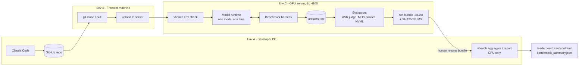
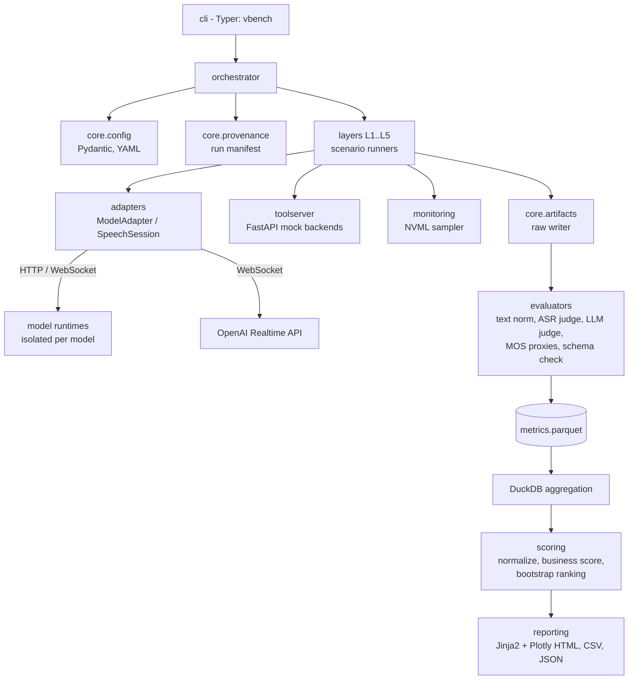
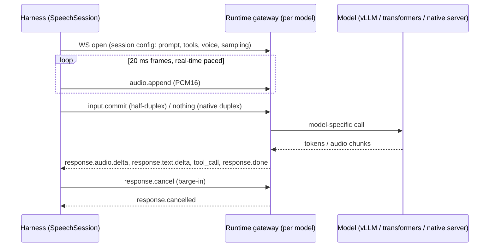
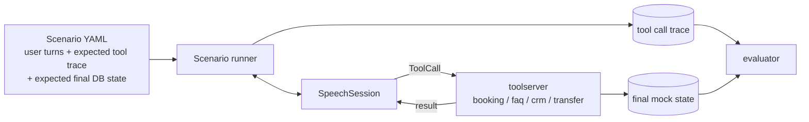

# Architecture — Japanese AI Call Center Speech-to-Speech Benchmark

| Field | Value |
|---|---|
| Status | **APPROVED** (2026-09-21). v0.2.0 applies review answers: no Docker on GPU server, vLLM-based serving in per-model `uv` venvs |
| Version | 0.2.0 |
| Date | 2026-09-21 |
| Scope | Benchmark framework for native Speech-to-Speech (S2S) models, Japanese call center use case |

---

## 1. Goals and Non-Goals

### 1.1 Goals

1. Compare 6 OSS native S2S models and 1 commercial baseline under **identical, reproducible** conditions.
2. Cover 5 layers: Japanese capability, realtime voice, tool calling, voice quality, infrastructure & TCO.
3. Produce a **business-oriented ranking** (35/25/15/15/10 weighting) derived **only from measured results**.
4. Make every number traceable: how measured, source data, timestamp, model version, code version.
5. Support the human-in-the-loop execution model: code is authored on a machine without GPU, executed by a human on a GPU server, and results are returned for analysis.

### 1.2 Non-Goals

- Training or fine-tuning models.
- Building a production call center system. The tool-calling backends are deterministic **mocks**.
- Finding the strongest research model. The question is "which model is most deployable for a Japanese call center on our hardware budget".
- Producing any number without an executed run. The framework never estimates, extrapolates, or imputes metric values.

---

## 2. Hard Constraints

| # | Constraint | Architectural consequence |
|---|---|---|
| C1 | Developer machine (Env A) has no GPU | Everything except model inference must run on CPU. A `mock` adapter enables full end-to-end tests without GPU. Scoring/reporting runs on Env A from returned artifacts. |
| C2 | GPU server (Env C) is operated by a human, not by Claude | Execution is packaged as a small number of CLI commands with a preflight check. Outputs are bundled into one archive with checksums for the return trip. |
| C3 | 1x H100 80GB | Models are benchmarked **one at a time**. No two models are resident simultaneously (except the evaluator ASR/judge, which is loaded in a separate phase). |
| C4 | 200GB SSD | Model weights are downloaded, benchmarked, and evicted per model. Datasets store audio compactly (16 kHz / 24 kHz mono FLAC). Raw artifacts are pruned/compressed per run. A disk budget check is part of preflight. |
| C5 | Models have conflicting Python dependencies | Each model is served in its **own `uv` virtual environment** (no Docker on the GPU server) behind a uniform network protocol. The harness never imports model code. |
| C6 | No fabricated results / labels | Metric values only come from `MetricRecord`s produced by evaluators from raw artifacts. Missing = `null` with reason, never 0 or a guess. Synthetic data is flagged. Mock runs can never enter a leaderboard. |

---

## 3. System Context



The pipeline is split so that **only inference and GPU-bound evaluation** happen on Env C. Aggregation, scoring, and reporting are deterministic CPU code that can be re-run anywhere from the returned bundle, which lets results be re-analyzed and re-scored without re-running GPU workloads.

---

## 4. Pipeline Stages

Every benchmark execution flows through five stages. Each stage reads only the outputs of previous stages from disk, so any stage can be re-run independently.

| Stage | Where | Input | Output | GPU? |
|---|---|---|---|---|
| **1. Prepare** | Env C | model registry entry, dataset manifests | weights downloaded + verified, runtime ready, dataset audio materialized + checksummed | no (network/disk) |
| **2. Collect** | Env C | running model server, dataset, run config | `artifacts/raw/<run_id>/…`: response audio, text, tool calls, event timelines, NVML samples | yes |
| **3. Evaluate** | Env C (GPU-bound evaluators) or Env A (CPU evaluators) | raw artifacts | `artifacts/processed/<run_id>/metrics.parquet` of `MetricRecord`s | partly |
| **4. Aggregate & Score** | anywhere | one or more processed runs | per-model layer scores, business score, ranking with confidence intervals | no |
| **5. Report** | anywhere | aggregated results | per-layer HTML/JSON reports, `leaderboard.*`, `benchmark_summary.json`, dashboards | no |

Human MOS ratings (Layer 4) enter at Stage 3 as an additional input stored under `datasets/human_reviewed/`.

---

## 5. Component Architecture



### 5.1 Repository layout

```text
benchmark/                      # Python package (import name: benchmark)
  cli.py                        # Typer app, entry point `vbench`
  core/
    config.py                   # Pydantic settings + YAML loading, env var overrides
    schemas.py                  # shared Pydantic models (MetricRecord, RunManifest, ...)
    provenance.py               # run_id, git sha, config hash, env capture
    artifacts.py                # artifact path layout, atomic writers, checksums
    logging.py                  # structlog JSON logging
    clock.py                    # monotonic timestamp helpers
    registry.py                 # model / dataset / layer registries
  adapters/
    base.py                     # ModelAdapter, SpeechSession, ModelEvent, capabilities
    mock.py                     # deterministic CPU adapter for tests (never rankable)
    openai_realtime.py          # GPT-Realtime baseline
    qwen3_omni.py
    minicpm_o.py
    step_audio.py
    glm4_voice.py
    llama_omni2.py
    baichuan_omni.py
  runtimes/                     # per-model serving wrappers (run inside isolated env)
    <model>/pyproject.toml, uv.lock, server.py, launch.sh   # one isolated uv venv per model
  audio/
    io.py, resample.py, vad.py, streamer.py (real-time paced sender), mixer.py (barge-in injection)
  layers/
    layer1_japanese/            # ASR, understanding, intent/slot, keigo, long context
    layer2_realtime/            # TTFA, interrupt, barge-in, turn taking, duplex, stability
    layer3_toolcalling/         # booking, FAQ, CRM, transfer, structured output
    layer4_voice/               # MOS proxies, consistency, human MOS export/import
    layer5_infra/               # VRAM, throughput, concurrency sweep, cost/TCO
  toolserver/                   # FastAPI mock tools with deterministic state
  evaluators/
    ja_text.py                  # Japanese normalization, tokenization, CER/WER
    asr_judge.py                # transcribe model output audio
    llm_judge.py                # rubric-based judge, versioned prompts
    mos_proxy.py                # UTMOS/DNSMOS-style automatic predictors
    speaker.py                  # speaker-embedding consistency
  monitoring/
    nvml.py                     # GPU sampler (pynvml)
  scoring/
    normalize.py                # metric -> [0,1] via fixed anchors
    business.py                 # 35/25/15/15/10 aggregation
    ranking.py                  # bootstrap CIs, rank stability
  reporting/
    templates/                  # Jinja2 HTML templates
    layer_reports.py, leaderboard.py, summary.py
  annotation/
    mos_app.py                  # Gradio app for blind human MOS rating
configs/
  models/<model>.yaml           # model registry entries
  runs/<profile>.yaml           # smoke / standard / full run profiles
  prompts/ja/*.yaml             # versioned system prompts and judge rubrics
  scoring/anchors.yaml          # normalization anchors and SLOs
  cost/pricing.yaml             # GPU $/h, API prices (user-supplied, with source + date)
datasets/
  <dataset_name>/<version>/manifest.jsonl, DATASHEET.md, build.py
  human_reviewed/<dataset_name>/<version>/...
artifacts/{raw,processed,reports,dashboards}/   # git-ignored except .gitkeep
scripts/                        # server helper scripts (bash), bundle, prune
tests/                          # pytest, CPU-only, >= 80% coverage
docs/
.github/workflows/              # CI: lint, type check, tests, coverage
```

---

## 6. Model Integration

### 6.1 Isolation: runtime per model

The 7 targets use different frameworks, dependency pins, and serving styles. The harness therefore **never imports model code**. Each OSS model runs inside its own dedicated `uv` venv under `$VBENCH_HOME/runtimes/<model>/.venv` (Docker is not available on the GPU server) and exposes a thin **Model Gateway Protocol** over localhost. The harness talks to every model the same way.

**Serving backend policy (decided in review):**

1. **vLLM is the default serving engine.** Where vLLM (or its official omni/audio extension, if that is what the model's card prescribes) supports the model, the runtime launches vLLM as a local process and the gateway (`server.py`) wraps it.
2. **Fallback — official inference code.** If a model's audio path (e.g., speech decoder / talker / vocoder) is not supported by vLLM at the pinned vLLM version, the runtime uses the model's official inference code in the same venv. This is decided per model in Phase 2/9 from a smoke test, recorded as `runtime.engine` in the model YAML, and shown in every report, because engine choice affects latency and throughput.
3. vLLM version is pinned per runtime (`uv.lock`), and `vllm` / `torch` / CUDA versions are captured in the run manifest.
4. Weights are downloaded directly from Hugging Face on the GPU server (pinned `revision`), into `$HF_HOME` on the benchmark SSD.



The protocol is deliberately modelled on the event shape of the OpenAI Realtime API so that the commercial baseline and OSS models share one event vocabulary. For each OSS model, the gateway (`runtimes/<model>/server.py`) translates this protocol into the model's native inference API.

### 6.2 Adapter interface (harness side)

```python
class ModelCapabilities(BaseModel):
    native_full_duplex: CapabilityStatus      # claimed / verified / unsupported / unknown
    streaming_audio_output: CapabilityStatus
    native_tool_calling: CapabilityStatus
    text_output_channel: CapabilityStatus
    max_context_tokens: int | None
    input_sample_rate_hz: int
    output_sample_rate_hz: int

class SpeechSession(Protocol):
    async def send_audio(self, chunk: AudioChunk) -> None: ...
    async def commit_input(self) -> None: ...
    async def cancel_response(self) -> None: ...
    async def send_tool_result(self, call_id: str, result: dict[str, Any]) -> None: ...
    def events(self) -> AsyncIterator[ModelEvent]: ...
    async def close(self) -> None: ...

class ModelAdapter(Protocol):
    model_id: str
    capabilities: ModelCapabilities
    async def health(self) -> RuntimeHealth: ...
    async def open_session(self, cfg: SessionConfig) -> SpeechSession: ...
```

`ModelEvent` is a discriminated union: `AudioDelta`, `TextDelta`, `ToolCall`, `ResponseDone`, `ResponseCancelled`, `Error`. **All timestamps are taken by the harness on receipt** (`time.monotonic_ns()`), never taken from model-reported values, so latency is comparable across models.

### 6.3 Capability matrix and "unsupported" handling

Model capabilities (full duplex, native tool calling, streaming output, Japanese support) are recorded in `configs/models/<model>.yaml` with two separate fields: `claimed` (with a model-card URL as source) and `verified` (set only by a Phase 2 smoke test run). Architecture does **not** assume any model supports any capability.

When a capability is missing, the framework uses a **documented, uniform fallback** and tags the result:

| Missing capability | Fallback | Result tag |
|---|---|---|
| Native full duplex / barge-in | Harness-side VAD orchestrator cancels generation when user speech is detected | `mode=orchestrated` (reported separately from `mode=native`) |
| Native tool calling | Prompted JSON tool protocol (same prompt template for all such models), parsed by harness | `tool_mode=prompted` |
| Streaming audio output | Measure full-response latency; TTFA = time to complete audio | `streaming=false` |
| Not runnable at all (OOM, broken release) | None | metric = `null`, `status=not_measured`, reason recorded |

Leaderboards display these tags next to scores so orchestrated and native results are never silently mixed.

### 6.4 Model registry entry (example shape)

```yaml
# configs/models/qwen3_omni.yaml
model_id: qwen3-omni-30b-a3b-fp8
display_name: Qwen3-Omni-30B-A3B (FP8)
source:
  hub: huggingface
  repo: <repo id>            # filled in Phase 2 from the official model card
  revision: <commit sha>     # pinned; never "main"
license: <SPDX or URL>       # recorded for deployment eligibility review
runtime:
  kind: venv                 # venv | remote_api
  engine: vllm               # vllm | official  (decided by Phase 2 smoke test)
  vllm_version: <pinned>
  venv_path: runtimes/qwen3_omni/.venv
  gateway_port: 18001
  launch_timeout_s: 900
capabilities:
  native_full_duplex: {claimed: unknown, verified: unknown, source: null}
  native_tool_calling: {claimed: unknown, verified: unknown, source: null}
sampling:                    # per-model defaults, recorded in run manifest
  temperature: <value from model card>
  top_p: <value>
  seed: 1234
disk_estimate_gb: null       # measured in Phase 2, not guessed
```

The commercial baseline uses `runtime.kind: remote_api`, credentials come only from environment variables (`OPENAI_API_KEY`), and the exact API model string and API version are pinned in config and recorded in every manifest.

---

## 7. Interaction Modes

Two execution modes cover all layers:

| Mode | Used by | Behaviour |
|---|---|---|
| **Turn mode** | L1, L3, L4 | Full user utterance sent (fast, not paced), wait for `ResponseDone`. Measures quality, not timing. Deterministic sampling where the model allows it. |
| **Streaming mode** | L2, L5 | Audio sent in 20 ms frames at real-time pace by `audio.streamer`. Barge-in audio injected at scripted offsets by `audio.mixer`. Full event timeline recorded. |

Multi-turn scenarios (long context memory, booking flows) are scripted dialogues: each user turn is a pre-recorded or synthesized audio file; the next user turn is sent after the model finishes (turn mode) or at a scripted time (streaming mode). User turns never depend on model output content, which keeps runs comparable across models. Dialogues that require branching are out of scope for v1.

---

## 8. Layer Designs

For precise metric formulas see `docs/METRIC_DEFINITIONS.md` (to be written in Phase 0b). This section defines the measurement mechanism.

### 8.1 Layer 1 — Japanese Capability

| Metric | Mechanism |
|---|---|
| ASR CER / WER | Task prompt asks the model to transcribe/repeat the utterance. Output text channel (if present) and ASR-judge transcript of output audio are scored separately. CER on NFKC-normalized text with punctuation removed; WER on MeCab (fugashi + UniDic) tokens. |
| Intent classification | Customer utterance → model asked for structured intent label from a closed set in the system prompt. Accuracy + macro-F1 against gold labels. |
| Slot extraction | Same utterances, gold slots (date, time, name, phone, product…). Slot-level precision/recall/F1 after value normalization (dates to ISO, numbers to half-width). |
| Japanese understanding | Question answering over spoken Japanese passages, closed-form answers scored exactly; open-form scored by LLM judge with rubric. |
| Keigo compliance | Model's spoken response → ASR judge → (a) rule-based detector for forbidden casual forms / required honorific patterns, (b) LLM judge with keigo rubric. Judge calibrated against a human-labeled subset; agreement (Cohen's κ) reported. |
| Long context memory | Multi-turn dialogues where early-turn facts are queried later. Recall accuracy by turn distance buckets. |

**Evaluator bias control.** The ASR judge (e.g., a Whisper-class model, pinned version) is the same for all models and is also run on the *reference* audio to report its own error floor. LLM judges run with temperature 0, pinned model version, and versioned rubric prompts; the judge model must not be one of the benchmarked models.

### 8.2 Layer 2 — Realtime Voice

All latencies are measured on the GPU server over localhost (network excluded by design; the cloud baseline includes network and is labelled as such, with measured RTT to the API reported alongside).

| Metric | Definition (summary) |
|---|---|
| TTFA | `t(first AudioDelta with non-silent content) − t(end of user speech)`, where end of user speech is known exactly from the stimulus file. P50/P95/P99 reported. |
| Interrupt latency | Barge-in audio injected at a scripted offset while the model is speaking. `t(model output audio stops) − t(barge-in onset)`. Stop = cancel event or ≥ N ms of silence in output stream. |
| Barge-in success | Share of barge-ins where output stopped within SLO **and** the model's next response addresses the interrupting utterance (LLM-judged). |
| False barge-in | Backchannel / noise injection ("はい", "ええ", cough) should *not* stop the model. Share of wrongful stops. |
| Turn taking | Distribution of response gap; overlap rate; premature responses during user mid-utterance pauses. |
| Duplex interaction | Only for `native_full_duplex=verified`; otherwise reported as `unsupported`. |
| Long conversation stability | 10–30 minute scripted calls: TTFA drift over time, error/crash rate, VRAM growth, response-quality drift (L1 checks on late turns). |

### 8.3 Layer 3 — Tool Calling



- **Tool definitions** are JSON Schemas shared by all models (native function calling where verified, prompted JSON otherwise).
- **toolserver** is a FastAPI app with deterministic, seedable in-memory state (calendar slots, CRM records, FAQ KB, transfer queues). Reset per scenario.
- Metrics:
  - *Tool success rate*: calls that are schema-valid and succeed against the backend.
  - *JSON accuracy*: schema validity rate and exact/normalized argument match vs expected trace.
  - *Hallucinated tool rate*: calls to undefined tools, or arguments with values not grounded in the dialogue or prior tool results.
  - *Task completion rate*: final mock state equals expected final state (booking created with correct slot, transfer to correct queue, etc.). Tool-trace order differences are allowed if the final state is correct.

### 8.4 Layer 4 — Voice Quality

| Component | Mechanism |
|---|---|
| Automatic MOS proxies | Pretrained MOS predictors (pinned versions). Japanese validity of each predictor is an explicit caveat; predictors are calibrated against human MOS on a subset and the correlation is reported. |
| Pronunciation | ASR-roundtrip CER on scripted read-aloud prompts (model asked to say fixed Japanese text including numbers, dates, names, business vocabulary). |
| Accent quality | Human-rated. Optional automatic proxy: pitch-accent comparison via F0 contour against reference readings (experimental, not in business score until validated). |
| Emotional expression | Scripted prompts requiring apology / empathy / cheerful tone; human rating. |
| Consistency | Speaker-embedding cosine similarity across turns and sessions (same voice config). |
| Human MOS | `annotation/mos_app.py` (Gradio): blind, randomized, model identity hidden, anchors/attention checks included, ≥ N raters per clip. Ratings exported as CSV into `datasets/human_reviewed/`. MOS with 95% CI reported. |

### 8.5 Layer 5 — Infrastructure & TCO

| Metric | Mechanism |
|---|---|
| VRAM usage | NVML sampling at 10 Hz during idle, single call, and each concurrency level; peak and steady state. |
| GPU utilization | NVML SM utilization, same sampling. |
| Throughput | Audio seconds generated per wall-clock second; tokens/s where exposed. |
| Concurrent calls | Concurrency sweep N = 1, 2, 4, 8, … streaming-mode calls. **Max concurrent calls** = largest N where TTFA P95 ≤ SLO and error rate ≤ SLO (SLOs in `configs/scoring/anchors.yaml`). |
| Cost per minute | `gpu_hourly_cost / (60 × max_concurrent_calls_at_SLO)` for OSS; token-usage × configured price for the API baseline. |
| Cost per call | Cost per minute × measured mean call duration of the standard scenario set. |
| TCO | Configurable model (hardware amortization or cloud rental, power, ops overhead, target call volume). All price inputs are **user-supplied** in `configs/cost/pricing.yaml` with a `source` and `as_of` date; the framework never assumes a price. |

---

## 9. Data Model and Provenance

### 9.1 Run manifest

Written at the start of every run (`artifacts/raw/<run_id>/manifest.json`) and finalized at the end.

```python
class RunManifest(BaseModel):
    run_id: str                  # ULID, time-sortable
    profile: str                 # smoke | standard | full
    is_mock: bool                # True => can never be ranked
    started_at: datetime         # UTC
    finished_at: datetime | None
    git_commit: str
    git_dirty: bool              # dirty => run is flagged non-reproducible
    config_sha256: str           # hash of fully resolved config
    model: ModelVersion          # model_id, repo, revision sha, engine, engine version, runtime uv.lock sha256
    datasets: list[DatasetRef]   # name, version, manifest sha256
    environment: EnvInfo         # host, GPU name, driver, CUDA, python, key package versions
    seeds: dict[str, int]
    layers: list[str]
    status: Literal["running", "completed", "failed", "partial"]
```

### 9.2 Metric record

Every number that appears in any report traces back to one or more `MetricRecord`s.

```python
class MetricRecord(BaseModel):
    run_id: str
    model_id: str
    model_revision: str
    layer: Literal["L1", "L2", "L3", "L4", "L5"]
    metric: str                  # e.g. "l2.ttfa_ms"
    sample_id: str | None        # None for aggregate records
    value: float | None          # None => not measured
    unit: str
    status: Literal["measured", "not_measured", "unsupported", "error"]
    reason: str | None
    method: str                  # evaluator name + version, links to METRIC_DEFINITIONS.md
    source_files: list[str]      # raw artifact paths relative to run dir
    measured_at: datetime
    tags: dict[str, str]         # mode=orchestrated, tool_mode=prompted, ...
```

Per-sample records are stored; aggregates are computed in DuckDB, so every aggregate can be re-derived and bootstrapped.

### 9.3 Artifact layout

```text
artifacts/
  raw/<run_id>/
    manifest.json
    logs/run.jsonl                         # structured logs
    <layer>/<sample_id>/
      input.flac, output.flac
      events.jsonl                         # harness-timestamped event timeline
      tool_trace.jsonl                     # L3 only
    monitoring/nvml.parquet
    SHA256SUMS
  processed/<run_id>/
    metrics.parquet                        # MetricRecord rows
    layer_summaries.json
  reports/<report_id>/
    layer1_japanese.{json,html}  ...  layer5_infra.{json,html}
    leaderboard.csv, leaderboard.json, leaderboard.html
    benchmark_summary.json
  dashboards/<report_id>/index.html
```

`vbench bundle create <run_id>` produces `<run_id>.tar.zst` (raw events + processed metrics + logs, optionally audio) with `SHA256SUMS`. `vbench bundle verify` validates it on Env A before any analysis.

---

## 10. Scoring and Ranking

### 10.1 Normalization

Each metric is mapped to `[0, 1]` using **fixed anchors** from `configs/scoring/anchors.yaml` (e.g., TTFA: 1.0 at ≤ `best_ms`, 0.0 at ≥ `worst_ms`, linear or log in between). Fixed anchors — rather than min-max across models — keep scores stable when a model is added or removed. Anchors are business SLOs set by the project owner before results are seen, and are versioned; changing them creates a new scoring version.

### 10.2 Business score

| Dimension | Weight | Built from |
|---|---|---|
| Japanese Quality | 35% | L1: CER, intent F1, slot F1, understanding, keigo, long context |
| Task Completion | 25% | L3: task completion rate (primary), tool success, JSON accuracy, hallucinated tool rate (penalty) |
| Barge-In | 15% | L2: interrupt latency, barge-in success, false barge-in rate, TTFA |
| Cost | 15% | L5: cost per minute at SLO |
| Voice Quality | 10% | L4: human MOS (primary), automatic proxies only if human MOS is not yet available (flagged) |

Sub-weights inside each dimension live in `configs/scoring/business_v1.yaml` and are reported with every leaderboard.

### 10.3 Missing data policy

- `unsupported` → dimension component scores 0 (the capability genuinely does not exist) and is visibly tagged.
- `not_measured` / `error` → **no imputation**. The model's business score is marked `incomplete`; it appears in the leaderboard below complete models with the missing dimensions listed, and is never assigned a rank position among complete models.
- `is_mock=true` or `git_dirty=true` runs are rejected by the leaderboard builder (dirty runs allowed only with explicit `--allow-dirty`, and then flagged).

### 10.4 Uncertainty

Business score 95% CIs are computed by bootstrap over samples within each layer. The leaderboard shows rank, score, CI, and a pairwise "significantly better than next" indicator. Ties within CI are reported as ties.

### 10.5 Deployment gates (reported, not scored)

Pass/fail gates shown beside the ranking: fits on 1x H100 80GB, produces Japanese speech output, license permits commercial deployment (manual review field), runtime stable over long-call test. A model failing a gate stays in the table but is flagged "not deployable as benchmarked".

---

## 11. Datasets (summary)

Full spec in `docs/DATASET_SPEC.md` (Phase 0b). Key principles:

- Directory: `datasets/<name>/<version>/` with `manifest.jsonl` (one sample per line: id, audio path, sha256, transcript, labels, `synthetic` flag, `source`, `license`), `DATASHEET.md`, and a `build.py` that reproduces the dataset from sources.
- **Audio is not committed to git.** Manifests and build scripts are; audio is fetched/generated on the server by `vbench data prepare` and verified by checksum.
- Source categories:
  1. Public Japanese speech corpora with compatible licenses (for ASR/CER).
  2. Call center scenario scripts written in Japanese (intent, slot, tool calling, keigo), rendered to audio by TTS → `synthetic: true`, generator and voice recorded.
  3. Human-recorded versions of a subset of scenarios → `datasets/human_reviewed/`.
- Labels for synthetic scenarios are **defined by construction** in the scenario spec (the script says which intent and slots it contains); they are not produced by any model. Human-reviewed labels are stored separately with reviewer IDs (pseudonymous) and dates.
- Every dataset version is immutable; changes create a new version.

---

## 12. Cross-Cutting Concerns

| Concern | Decision |
|---|---|
| Configuration | Pydantic models loaded from YAML; env vars override (prefix `VBENCH_`); secrets only from env; no hardcoded paths (all paths relative to `VBENCH_HOME`, default repo root). |
| Logging | `structlog` JSON lines to stdout and `logs/run.jsonl`; every line carries `run_id`, `model_id`, `layer`, `sample_id`. No `print`. |
| Reproducibility | Pinned model revisions, per-runtime `uv.lock` hashes, pinned vLLM version, fixed seeds, resolved-config hash, dataset checksums, deterministic sampling where supported, N repeats for stochastic metrics. |
| Fault tolerance | Per-sample checkpointing: a crashed run resumes from the last completed sample (`vbench run --resume <run_id>`). Per-sample timeouts produce `status=error` records, not aborts. |
| Testing | pytest, CPU-only, `mock` adapter + recorded fixture timelines; coverage gate ≥ 80% in CI. GPU paths are exercised only by server-side smoke runs. |
| CI | GitHub Actions: `ruff`, `mypy --strict` on `benchmark/`, `pytest --cov`, schema/config validation, dataset manifest lint. |
| Security | No credentials in repo; `.env` git-ignored; API key presence checked in preflight without logging it. |

---

## 13. CLI Surface (planned)

```text
vbench env check                         # GPU, driver, CUDA, disk budget, uv, HF + OpenAI reachability, API keys present
vbench data prepare  --dataset <name>@<version>
vbench model prepare --model <id>        # download pinned weights, build runtime, verify checksums
vbench model serve   --model <id>        # start runtime, wait for health
vbench model evict   --model <id>        # free disk
vbench run    --model <id> --profile smoke|standard|full [--layers L1,L3] [--resume <run_id>]
vbench evaluate <run_id> [--evaluators gpu|cpu|all]
vbench bundle create <run_id> / vbench bundle verify <file>
vbench aggregate <run_id>...             # CPU, Env A friendly
vbench report   <report_id>
vbench leaderboard --runs <run_id>... [--scoring business_v1]
vbench mos export|serve|import           # human MOS workflow
```

A `scripts/run_all.sh` wraps the per-model loop (prepare → serve → run → evaluate → bundle → evict) so the human operator runs one command per model or one for all.

---

## 14. Key Risks

| Risk | Impact | Mitigation |
|---|---|---|
| A model's official release lacks a usable streaming/duplex server | L2 incomparable | Gateway protocol + documented orchestrated fallback, tagged results |
| Total weights exceed 200GB SSD | Cannot co-host | Per-model prepare/evict; disk check in preflight; measured sizes recorded in Phase 2 |
| Dependency conflicts / CUDA mismatch per model | Runtime failures | Isolated `uv` venv per model; pinned lockfiles; smoke test before any full run |
| vLLM does not support a model's audio output path | Model cannot be served by vLLM | Documented fallback to official inference code; engine recorded and reported |
| Evaluator bias (ASR judge, LLM judge, MOS predictor weak on Japanese) | Distorted scores | Judge error floor on reference audio, human calibration subset, agreement metrics reported, human MOS primary for L4 |
| GPT-Realtime measured over internet vs OSS over localhost | Unfair latency comparison | Report separately labelled; RTT measured; optional network emulation for OSS |
| Round-trip delay (human-in-the-loop) | Slow iteration | Smoke profile (minutes) before full profile; resumable runs; rich logs so one round-trip is enough to debug |
| Synthetic TTS stimuli differ from real callers | Optimistic results | Human-recorded subset; results reported per stimulus source |
| Model license restricts commercial use | Winner not deployable | License gate reported next to ranking |

---

## 15. Open Questions for Review

Resolved in review (2026-09-21):

- ~~Runtime isolation~~ — No Docker. Models are served with vLLM in per-model `uv` venvs (§6.1).
- ~~Internet on GPU server~~ — The server downloads models directly from Hugging Face.
- ~~GPT-Realtime access~~ — The server can reach the OpenAI API; the baseline runs from the GPU server.

Still open (to be answered during Phase 0b):

1. **Japanese stimulus audio:** Which TTS may be used to synthesize scenario audio (license must allow benchmark use), and can the team record a human subset (how many speakers/hours)?
2. **Human MOS raters:** How many native Japanese raters are available, and roughly how many clips can they rate?
3. **LLM judge:** Which judge model is acceptable (must not be a benchmarked model; requires API access)?
4. **SLOs / anchors:** Target TTFA P95, interrupt latency, and max acceptable cost per minute — these define normalization and must be fixed before results are seen.
5. **Cost inputs:** GPU pricing basis for TCO (owned H100 amortized vs cloud rental rate).
6. **Business domain:** Primary call types to emphasize (appointment booking, order inquiry, support, ...) for scenario weighting.
