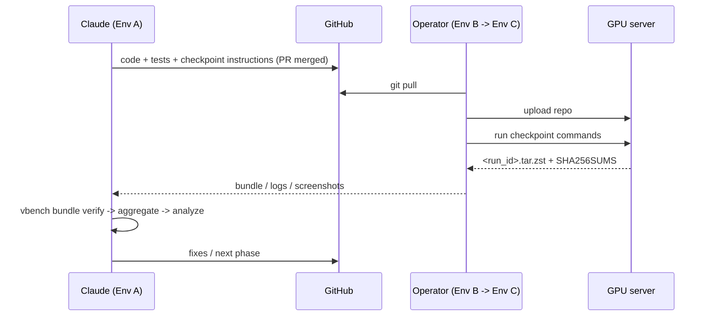

# Implementation Roadmap

| Field | Value |
|---|---|
| Status | **APPROVED** (2026-09-21) |
| Version | 0.2.0 |
| Date | 2026-09-21 |
| Depends on | `docs/ARCHITECTURE.md` v0.2.0 |

---

## 1. Principles

1. **Vertical slice first.** Get one model through one layer to a (partial) leaderboard end-to-end before widening. This validates the whole pipeline — including the human round-trip — as early as possible.
2. **Mock before GPU.** Every phase is finished and tested on Env A with the `mock` adapter before any GPU command is handed to the operator.
3. **Smoke before full.** Every GPU checkpoint starts with the `smoke` profile (target: minutes of GPU time), then `standard`, then `full`.
4. **One human round-trip per checkpoint.** Each checkpoint lists exact commands to run and exact files to return. Logs are rich enough to debug from one bundle.
5. **Incremental review.** Each phase ends with a PR; the next phase starts only after review.
6. **No results in code or docs until measured.** Placeholders are `null` / `TBD`, never plausible-looking numbers.

---

## 2. Execution Loop (per checkpoint)



Every checkpoint below is marked **⏸ HITL**. At that point Claude stops and asks: *"Run the benchmark on the GPU server and provide the output."*

---

## 3. Phase Overview

| Phase | Name | GPU checkpoint | Main output |
|---|---|---|---|
| 0a | Architecture & roadmap | no | this document, `ARCHITECTURE.md` |
| 0b | Specifications | no | `DATASET_SPEC.md`, `METRIC_DEFINITIONS.md`, `DEPLOYMENT_GUIDE.md`, scoring anchors |
| 1 | Core framework | ⏸ env check | package skeleton, config, provenance, logging, artifacts, CLI, mock adapter, CI |
| 2 | Model gateway + first adapters | ⏸ smoke per model | gateway protocol, runtime for reference OSS model + GPT-Realtime, capability verification |
| 3 | Vertical slice: L1 ASR → leaderboard | ⏸ smoke L1 | L1 ASR/CER, evaluate, aggregate, scoring, leaderboard (partial) |
| 4 | Layer 1 complete | ⏸ standard L1 | intent, slot, understanding, keigo, long context, judge calibration |
| 5 | Layer 3 tool calling | ⏸ standard L3 | toolserver, scenarios, tool metrics |
| 6 | Layer 2 realtime | ⏸ standard L2 | streamer, barge-in mixer, latency metrics, orchestrated fallback |
| 7 | Layer 5 infra & TCO | ⏸ concurrency sweep | NVML sampler, concurrency sweep, cost model |
| 8 | Layer 4 voice quality | ⏸ L4 + human MOS | MOS proxies, consistency, Gradio MOS app, human MOS import |
| 9 | Remaining adapters | ⏸ smoke per model | runtimes for all 6 OSS models |
| 10 | Full benchmark & final ranking | ⏸ full run | final leaderboard, business report, analysis |
| 11 | Iteration | as needed | fixes from analysis, dataset v2, rescoring |

Phases 4–8 can be reordered after Phase 3 if priorities change; each depends only on Phases 1–3.

---

## 4. Phase Details

### Phase 0a — Architecture & Roadmap

- Deliverables: `docs/ARCHITECTURE.md`, `docs/IMPLEMENTATION_ROADMAP.md`.
- Exit: both approved by reviewer; open questions in ARCHITECTURE §15 answered or explicitly deferred.

### Phase 0b — Specifications

- Deliverables:
  - `docs/METRIC_DEFINITIONS.md`: every metric with formula, unit, direction, evaluator, source artifact, normalization anchor, and which business dimension it feeds.
  - `docs/DATASET_SPEC.md`: manifest schema, dataset list per layer with source/license, synthetic vs human-reviewed policy, versioning, scenario YAML schema for L1/L2/L3.
  - `docs/DEPLOYMENT_GUIDE.md`: server prerequisites, directory layout on server, per-model runtime setup, disk budget procedure, bundle return procedure.
  - `configs/scoring/anchors.yaml` + `business_v1.yaml` — **values set by the project owner** (SLOs), not by Claude.
- Exit: specs approved; anchors signed off before any result is seen.

### Phase 1 — Core Framework (CPU only)

- Deliverables:
  - `pyproject.toml` (Python 3.11+, `uv`), `ruff`, `mypy`, `pytest` config.
  - `benchmark/core/*`: config, schemas (`RunManifest`, `MetricRecord`, `ModelEvent`, …), provenance, artifacts (atomic writes, SHA256SUMS), structlog logging, registries.
  - `benchmark/adapters/base.py` + `mock.py` (deterministic synthetic events, configurable latency/failures, `is_mock=true`).
  - `benchmark/cli.py` with `env check`, `run` (mock only), `bundle`, `bundle verify`.
  - `vbench env check`: GPU/driver/CUDA via NVML, free disk vs budget, `uv` available, outbound network to model hubs and OpenAI API, env vars present (values never logged).
  - `.github/workflows/ci.yml`: lint, type check, tests, coverage ≥ 80%.
  - `.gitignore` for `artifacts/**` (keep `.gitkeep`), `.env`, model caches.
- Tests: schema round-trips, provenance capture, artifact checksums, mock run produces valid manifest + events, leaderboard builder rejects `is_mock` runs.
- **⏸ HITL checkpoint 1:** operator runs
  ```bash
  set -a; source $VBENCH_HOME/.env; set +a
  uv sync
  uv run vbench env check --output $VBENCH_HOME/bundles/env_report.json
  uv run vbench run --model mock --profile mock_smoke            # prints RUN_ID
  uv run vbench bundle create <RUN_ID>
  ```
  and returns `env_report.json` plus the mock bundle (`<RUN_ID>.tar.zst` + `.SHA256SUMS`), which proves the collect -> bundle -> verify round trip works on the server. Claude uses it to finalize the per-model venv layout, vLLM/CUDA compatibility, and disk plan.
- Exit: CI green, env report received and reviewed.

### Phase 2 — Model Gateway & First Adapters

- Deliverables:
  - Gateway protocol spec (`docs/GATEWAY_PROTOCOL.md`) + shared gateway base server (FastAPI WebSocket) used by all runtimes.
  - Runtime (`uv` venv + vLLM, official-code fallback if vLLM cannot serve the audio path) for **one reference OSS model** (proposed: Qwen3-Omni-30B-A3B-FP8) and adapter.
  - `openai_realtime.py` adapter for GPT-Realtime baseline (model string + API version pinned in config).
  - `vbench model prepare|serve|evict`, health checks, launch timeouts.
  - `smoke` profile: ~10 Japanese utterances in turn mode + 2 in streaming mode + 1 tool call + 1 barge-in, purely to verify capabilities and the pipeline, not to score.
  - Capability verification: smoke results write `verified` fields into a capability report (not into the model YAML automatically; reviewed first).
- Tests: gateway protocol conformance suite run against the mock runtime; adapter unit tests with recorded WebSocket fixtures.
- **⏸ HITL checkpoint 2:**
  ```bash
  uv run vbench model prepare --model qwen3-omni-30b-a3b-fp8
  uv run vbench model serve   --model qwen3-omni-30b-a3b-fp8
  uv run vbench run --model qwen3-omni-30b-a3b-fp8 --profile smoke
  uv run vbench run --model gpt-realtime --profile smoke
  uv run vbench bundle create <run_id>   # for each run
  ```
  Return: bundles + measured disk usage of weights and venvs.
- Exit: both models complete smoke run; capability report reviewed.

### Phase 3 — Vertical Slice: Layer 1 ASR → Leaderboard

- Deliverables:
  - `evaluators/ja_text.py`: NFKC normalization, punctuation/whitespace rules, full/half-width unification, number handling policy; CER; WER via fugashi + UniDic.
  - `evaluators/asr_judge.py`: pinned ASR model for output-audio transcription; judge error floor computed on reference audio.
  - First dataset: `datasets/ja_asr_eval/v1` manifest + `build.py` from a licensed public corpus subset.
  - `vbench evaluate`, `vbench aggregate` (DuckDB), `scoring/normalize.py`, `scoring/business.py` (with missing-data policy), `reporting/` for L1 report + leaderboard + `benchmark_summary.json`.
- Tests: CER/WER against hand-computed Japanese cases; normalization edge cases; scoring with missing/unsupported data; leaderboard rendering snapshot tests.
- **⏸ HITL checkpoint 3:** `smoke` then `standard` L1-ASR for the 2 Phase-2 models; return bundles.
- Exit: `leaderboard.{csv,json,html}` generated on Env A from returned bundles, clearly marked **partial (L1-ASR only)**.

### Phase 4 — Layer 1 Complete

- Deliverables: intent, slot, understanding, keigo, long-context runners and evaluators; scenario datasets `ja_callcenter_intent_slot/v1`, `ja_keigo/v1`, `ja_long_context/v1` (synthetic, flagged); `evaluators/llm_judge.py` with versioned rubric prompts; keigo rule-based detector; human-labeled calibration subset workflow.
- Tests: slot value normalization, keigo detector unit cases, judge response parsing and retry, calibration statistics (κ).
- **⏸ HITL checkpoint 4:** `standard` L1 for 2 models; human labels for keigo calibration subset returned.
- Exit: L1 report with judge agreement figures.

### Phase 5 — Layer 3 Tool Calling

- Deliverables: `toolserver/` (booking, FAQ, CRM lookup, call transfer, structured output) with seedable state; tool JSON Schemas; scenario schema + `ja_toolcalling/v1` scenarios with expected traces and expected final state; prompted-JSON fallback protocol; L3 evaluators and report.
- Tests: toolserver determinism, trace-vs-expected matcher (order-insensitive where allowed), hallucination detector, state comparator.
- **⏸ HITL checkpoint 5:** `standard` L3 for 2 models.
- Exit: L3 report; task completion rate per scenario category.

### Phase 6 — Layer 2 Realtime

- Deliverables: `audio/streamer.py` (real-time paced 20 ms frames, drift-corrected), `audio/mixer.py` (barge-in / backchannel / noise injection at scripted offsets), harness-side VAD orchestrator for non-duplex models, event-timeline analyzers (TTFA, interrupt latency, barge-in success, false barge-in, turn-taking gaps), long-call stability runner, API RTT probe for GPT-Realtime.
- Tests: pacing accuracy on CPU, timeline analyzers on synthetic timelines with known answers, orchestrator state machine.
- **⏸ HITL checkpoint 6:** `standard` L2 for 2 models (includes a 10-minute stability call).
- Exit: L2 report with P50/P95/P99 and native vs orchestrated tagging.

### Phase 7 — Layer 5 Infrastructure & TCO

- Deliverables: `monitoring/nvml.py` sampler (background, 10 Hz, parquet), concurrency sweep runner with SLO-based stop, cost model reading `configs/cost/pricing.yaml` (user-supplied prices with `source` + `as_of`), TCO calculator, L5 report.
- Tests: sampler with fake NVML, sweep stop logic, cost formulas.
- **⏸ HITL checkpoint 7:** concurrency sweep for 2 models; operator supplies pricing inputs.
- Exit: L5 report with max concurrent calls at SLO and cost per minute.

### Phase 8 — Layer 4 Voice Quality

- Deliverables: MOS proxy evaluators (pinned), speaker-consistency evaluator, pronunciation read-aloud set `ja_read_aloud/v1`, emotion prompts, `annotation/mos_app.py` (Gradio, blind, randomized, attention checks), `vbench mos export|serve|import`, proxy-vs-human calibration report.
- Tests: MOS aggregation + CI, rater filtering by attention checks, blinding (no model id leaks into exported clip names).
- **⏸ HITL checkpoint 8:** L4 collection run for 2 models; human raters complete MOS session; ratings CSV returned.
- Exit: L4 report with human MOS + proxy correlation.

### Phase 9 — Remaining Adapters

- Deliverables: runtimes + adapters for MiniCPM-o 4.5, StepAudio 2.5 Realtime, GLM-4-Voice-9B, LLaMA-Omni 2, Baichuan-Omni-1.5 (each pinned to a specific revision found in its official repo/model card at implementation time); capability reports.
- Tests: gateway conformance suite per runtime (against recorded fixtures).
- **⏸ HITL checkpoint 9:** `smoke` per model; disk usage per model recorded.
- Exit: all 7 models pass smoke, or failures documented with `not_measured` reason.

### Phase 10 — Full Benchmark & Final Ranking

- Deliverables: `scripts/run_all.sh` (prepare → serve → run full → evaluate → bundle → evict, per model, resumable), final report template (executive summary, per-layer results, deployment gates, sensitivity analysis of business weights, limitations).
- **⏸ HITL checkpoint 10:** full profile for all 7 models; human MOS for all models.
- Exit: `leaderboard.{csv,json,html}` + `benchmark_summary.json` from measured data only; analysis document reviewed.

### Phase 11 — Iteration

Driven by Phase 10 analysis: fix measurement issues, add dataset versions (e.g., more human-recorded audio), rescore with new anchor versions if the owner changes SLOs (old scores remain reproducible).

---

## 5. Run Profiles

| Profile | Purpose | Sample budget (target, per model) |
|---|---|---|
| `smoke` | Verify pipeline + capabilities | ~10–20 samples across layers; minutes of GPU time |
| `standard` | Per-layer development runs | a statistically usable subset per layer (size defined in `DATASET_SPEC.md`) |
| `full` | Final ranking | full datasets, N repeats for stochastic metrics |

Exact sizes and GPU-time estimates are set after checkpoint 2, from **measured** smoke-run durations.

---

## 6. Definition of Done (every phase)

- [ ] Code has type hints, Pydantic models at boundaries, structured logging, no hardcoded paths/credentials.
- [ ] Unit tests added; CI green; coverage ≥ 80%.
- [ ] Docs updated (`METRIC_DEFINITIONS.md` for new metrics, `DATASET_SPEC.md` for new datasets, `DEPLOYMENT_GUIDE.md` for new commands).
- [ ] Mock end-to-end run passes on Env A.
- [ ] HITL checkpoint instructions written (commands, expected runtime, files to return).
- [ ] No benchmark value appears anywhere that did not come from a returned bundle.

---

## 7. Immediate Next Steps

1. Reviewer approves or comments on `ARCHITECTURE.md` and this roadmap.
2. Answer open questions in `ARCHITECTURE.md` §15 — the three blocking questions are resolved; the rest are handled in Phase 0b.
3. Start Phase 0b (remaining specs), then Phase 1.
