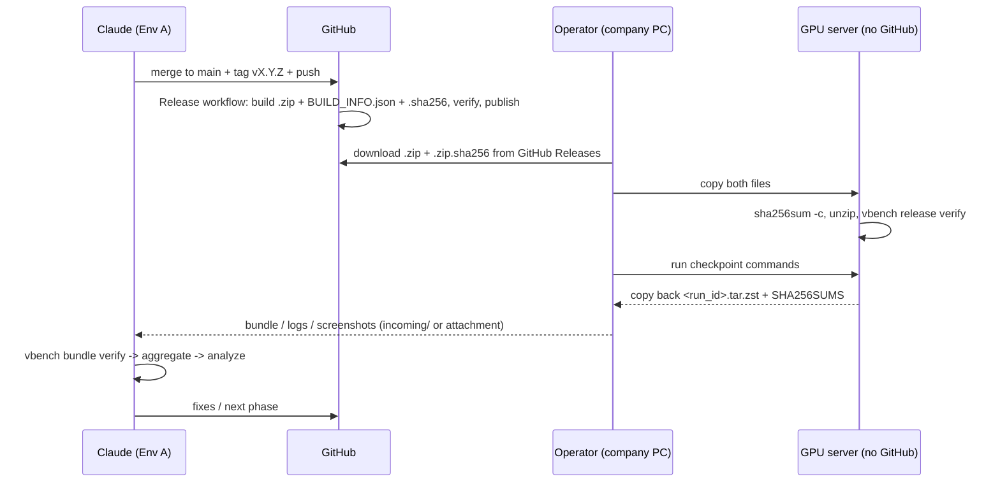

# Lộ trình triển khai

| Trường | Giá trị |
|---|---|
| Trạng thái | **ĐÃ DUYỆT** (2026-09-21), cập nhật 2026-09-22 cho server không kết nối GitHub |
| Phiên bản | 0.3.0 |
| Ngày | 2026-09-22 |
| Phụ thuộc | `docs/ARCHITECTURE.md` v0.3.0 |

> Bản tiếng Việt. Lệnh, tên file, tên metric và code giữ nguyên tiếng Anh.

---

## 1. Nguyên tắc

1. **Làm lát cắt dọc trước.** Đưa một model qua một lớp đến leaderboard (một phần) từ đầu đến cuối trước khi mở rộng. Cách này kiểm chứng toàn bộ pipeline — kể cả vòng gửi kết quả qua con người — càng sớm càng tốt.
2. **Mock trước, GPU sau.** Mỗi phase được hoàn thành và test trên Env A bằng adapter `mock` trước khi giao bất kỳ lệnh GPU nào cho người vận hành.
3. **Smoke trước, full sau.** Mỗi checkpoint GPU bắt đầu bằng profile `smoke` (mục tiêu: vài phút GPU), rồi đến `standard`, rồi `full`.
4. **Mỗi checkpoint một vòng gửi qua con người.** Mỗi checkpoint liệt kê chính xác lệnh cần chạy và file cần gửi về. Log đủ chi tiết để debug chỉ từ một bundle.
5. **Review từng bước.** Mỗi phase kết thúc bằng một lần review; phase sau chỉ bắt đầu khi đã review xong.
6. **Không có kết quả trong code hay tài liệu cho đến khi đo.** Chỗ chưa có giá trị để `null` / `TBD`, không bao giờ điền con số trông hợp lý.
7. **Luôn phát hành gói release trước mỗi checkpoint.** Trước khi nhờ người dùng chạy bất cứ thứ gì trên máy công ty hoặc GPU server, Claude merge vào `main`, tạo tag `vX.Y.Z`, push, và chờ workflow Release tạo xong gói `.zip` trên GitHub Releases. Hướng dẫn checkpoint ghi rõ tên release và tên file zip. GPU server không kết nối GitHub: người dùng tải gói trên máy công ty rồi copy file lên server (DEPLOYMENT_GUIDE §6.1).

---

## 2. Vòng thực thi (mỗi checkpoint)



Mỗi checkpoint dưới đây được đánh dấu **⏸ HITL**. Đến điểm đó Claude dừng lại và nói: *"Chạy benchmark trên máy chủ GPU và cung cấp đầu ra."*

---

## 3. Tổng quan các phase

| Phase | Tên | Checkpoint GPU | Đầu ra chính |
|---|---|---|---|
| 0a | Kiến trúc & lộ trình | không | tài liệu này, `ARCHITECTURE.md` |
| 0b | Đặc tả | không | `DATASET_SPEC.md`, `METRIC_DEFINITIONS.md`, `DEPLOYMENT_GUIDE.md`, anchor chấm điểm |
| 1 | Khung cốt lõi | ⏸ env check | khung package, config, provenance, logging, artifact, CLI, mock adapter, CI |
| 2 | Realtime adapter + model đầu tiên | ⏸ smoke từng model | adapter realtime, runtime vLLM-Omni cho MiniCPM-o 4.5 + Qwen3-Omni, adapter GPT-Realtime, xác minh năng lực |
| 3 | Lát cắt dọc: L1 ASR → leaderboard | ⏸ smoke L1 | L1 ASR/CER, evaluate, aggregate, chấm điểm, leaderboard (một phần) |
| 4 | Hoàn thiện Lớp 1 | ⏸ standard L1 | intent, slot, hiểu, keigo, ngữ cảnh dài, hiệu chỉnh judge |
| 5 | Lớp 3 tool calling | ⏸ standard L3 | toolserver, kịch bản, metric tool |
| 6 | Lớp 2 thời gian thực | ⏸ standard L2 | streamer, bộ trộn barge-in, metric độ trễ, phương án orchestrated |
| 7 | Lớp 5 hạ tầng & TCO | ⏸ quét mức đồng thời | NVML sampler, quét mức đồng thời, mô hình chi phí |
| 8 | Lớp 4 chất lượng giọng nói | ⏸ L4 + MOS người chấm | MOS proxy, tính nhất quán, ứng dụng MOS Gradio, nhập MOS người chấm |
| 9 | Các adapter còn lại | ⏸ smoke từng model | runtime cho cả 6 model OSS |
| 10 | Benchmark đầy đủ & xếp hạng cuối | ⏸ full run | leaderboard cuối, báo cáo kinh doanh, phân tích |
| 11 | Lặp cải tiến | khi cần | sửa lỗi từ phân tích, dataset v2, chấm điểm lại |

Phase 4–8 có thể đổi thứ tự sau Phase 3 nếu ưu tiên thay đổi; mỗi phase chỉ phụ thuộc Phase 1–3.

---

## 4. Chi tiết từng phase

### Phase 0a — Kiến trúc & Lộ trình ✅

- Sản phẩm: `docs/ARCHITECTURE.md`, `docs/IMPLEMENTATION_ROADMAP.md`.
- Điều kiện hoàn thành: cả hai được duyệt; câu hỏi mở ở ARCHITECTURE §15 đã được trả lời hoặc ghi rõ là hoãn lại.

### Phase 0b — Đặc tả ✅

- Sản phẩm:
  - `docs/METRIC_DEFINITIONS.md`: mỗi metric có công thức, đơn vị, chiều tốt, evaluator, artifact nguồn, anchor chuẩn hoá, và nhóm business score mà nó đóng góp.
  - `docs/DATASET_SPEC.md`: schema manifest, danh sách dataset theo lớp kèm nguồn/license, chính sách synthetic vs người review, phiên bản, schema YAML kịch bản cho L1/L2/L3.
  - `docs/DEPLOYMENT_GUIDE.md`: yêu cầu trên server, cấu trúc thư mục trên server, thiết lập runtime cho từng model, quy trình quản lý dung lượng đĩa, quy trình gửi bundle về.
  - `configs/scoring/anchors.yaml` + `business_v1.yaml` — **giá trị do chủ dự án đặt** (SLO), không phải Claude.
- Điều kiện hoàn thành: đặc tả được duyệt; anchor được ký duyệt trước khi thấy bất kỳ kết quả nào.

### Phase 1 — Khung cốt lõi (chỉ CPU) ✅ (checkpoint 1 đạt 2026-09-22)

- Sản phẩm:
  - `pyproject.toml` (Python 3.11+, `uv`), cấu hình `ruff`, `mypy`, `pytest`.
  - `benchmark/core/*`: config, schemas (`RunManifest`, `MetricRecord`, `ModelEvent`, …), provenance, artifacts (ghi nguyên tử, SHA256SUMS), logging bằng structlog, registries.
  - `benchmark/adapters/base.py` + `mock.py` (event synthetic tất định, độ trễ/lỗi cấu hình được, `is_mock=true`).
  - `benchmark/cli.py` với `env check`, `run` (chỉ mock), `bundle create`, `bundle verify`.
  - `vbench env check`: GPU/driver/CUDA qua NVML, dung lượng đĩa trống, có `uv`, kết nối mạng ra ngoài đến model hub và OpenAI API, có biến môi trường (không bao giờ ghi giá trị ra log).
  - `.github/workflows/ci.yml`: lint, type check, test, độ phủ ≥ 80%.
  - `.gitignore` cho `artifacts/**` (giữ `.gitkeep`), `.env`, cache model.
- Test: schema round-trip, ghi nhận provenance, checksum artifact, mock run tạo manifest + event hợp lệ, trình tạo leaderboard từ chối run `is_mock`.
- Bổ sung (2026-09-22): gói release offline — `vbench release build|verify`, workflow Release, `source_state()` (git hoặc release), kiểm tra `source_integrity`, `home_outside_repo`, `network:pypi` trong `env check`.
- **⏸ HITL checkpoint 1:** người vận hành đưa gói release lên server theo `DEPLOYMENT_GUIDE.md` §6.1 (kiểm tra sha256, giải nén, `uv sync`, `vbench release verify`), rồi chạy trong thư mục release:
  ```bash
  uv run vbench env check --output $VBENCH_HOME/bundles/env_report.json
  uv run vbench run --model mock --profile mock_smoke            # prints RUN_ID
  uv run vbench bundle create <RUN_ID>
  ```
  và gửi về output của `vbench release verify`, `env_report.json` cùng bundle mock (`<RUN_ID>.tar.zst` + `.SHA256SUMS`), chứng minh chuỗi thu thập → đóng gói → kiểm tra hoạt động trên server. Claude dùng kết quả này để chốt cấu trúc venv cho từng model, độ tương thích vLLM/CUDA và kế hoạch dùng đĩa.
- Điều kiện hoàn thành: CI xanh, đã nhận và review env report.

### Phase 2 — Realtime adapter & model đầu tiên ✅ code / ⏸ đang chờ checkpoint 2

Cập nhật 2026-09-22 sau khi tra tài liệu vLLM-Omni và nhận quyết định của chủ dự án:

- vLLM-Omni 0.28 có sẵn WebSocket `/v1/realtime` kiểu OpenAI cho Qwen3-Omni và MiniCPM-o 4.5, nên **không cần gateway riêng** cho hai model này; gateway chỉ cần ở Phase 9 cho model vLLM-Omni không hỗ trợ.
- Làm **cả hai** model ở Phase 2: MiniCPM-o 4.5 (cấu hình 1 GPU chính thức) và Qwen3-Omni-30B-A3B **BF16 chính thức** trên 1 H100 (cấu hình 1 GPU tự viết, chưa kiểm chứng).
- Nhóm không có người nói tiếng Nhật: smoke dùng **FLEURS ja_jp** (giọng người thật, CC-BY-4.0).
- Chưa có `OPENAI_API_KEY`: adapter GPT-Realtime đã viết và test bằng server giả lập; smoke GPT-Realtime hoãn đến khi có key và tên model API.

- Sản phẩm:
  - `docs/REALTIME_PROTOCOL.md` + `benchmark/adapters/realtime.py` (dialect `vllm_omni` và `openai`, chấp nhận cả tên event mới và cũ).
  - `benchmark/testing/fake_realtime.py`: server giả lập để test trên CPU.
  - `configs/runtimes/vllm_omni_0_28.yaml` (vllm==0.28.0, vllm-omni==0.28.0, Python 3.12), `configs/models/{minicpm-o-4_5,qwen3-omni-30b-a3b,gpt-realtime}.yaml` (revision chốt cứng), `configs/deploy/qwen3_omni_1gpu.yaml`.
  - `vbench model list|prepare|serve|status|stop|evict` (`benchmark/runtime/manager.py`): venv dùng chung, giới hạn đĩa 200 GB, khoá GPU, log server, `prepare_report.json` với dung lượng đo thực tế.
  - `vbench data prepare --dataset fleurs_ja_smoke`: 12 câu FLEURS; build phải khớp manifest tham chiếu trong repo.
  - Profile `smoke`: 8 câu turn (L1) + 2 câu tool call (L3) + 2 câu huỷ phản hồi (L2).
  - `capability_report.json` trong mỗi run: ghi lại quan sát (streaming audio, kênh text, tool call, huỷ phản hồi), không tự sửa cấu hình.
  - `vbench bundle create` tự đính kèm log server và `prepare_report.json`.
  - `env check`: `OPENAI_API_KEY` chuyển thành cảnh báo; thêm kiểm tra giới hạn đĩa.
- Test: adapter với server giả lập (turn, tool, huỷ, lỗi, từ chối session, tên event cũ, xác thực OpenAI), runner 3 loại tác vụ, capability report, bộ build FLEURS với dữ liệu giả, runtime manager với subprocess/HF giả, CLI end-to-end với server giả lập.
- **⏸ HITL checkpoint 2:** xem hướng dẫn checkpoint trong tin nhắn bàn giao và `DEPLOYMENT_GUIDE.md` §6.3. Gửi về: 2 bundle (mỗi model một run smoke), hoặc log `runtime_<model>.log` nếu `model serve` lỗi, cùng output của `model prepare`.
- Kết quả lần thử checkpoint 2 đầu tiên (2026-09-23): `model prepare` chạy được, nhưng `model serve` của MiniCPM-o 4.5 thất bại vì container thiếu `libGL.so.1` (tiến trình con của vLLM-Omni import `cv2`). Đã sửa ở v0.2.2: runtime chỉ dùng OpenCV bản headless, `model prepare` import thử các module trong venv và báo lỗi ngay, thêm lệnh `vbench model check`, tăng `--init-timeout`/`--stage-init-timeout` lên 1800 giây, và `env check` kiểm tra libGL/libglib.
- Lần thử thứ hai và thứ ba (2026-09-23): (a) gỡ `opencv-python` làm mất luôn thư mục `cv2` dùng chung, sửa ở v0.2.3 bằng cách gỡ cả hai bản rồi cài lại bản headless; (b) stage 2 (Token2Wav) của MiniCPM-o thiếu `s3tokenizer`/`stepaudio2`, sửa ở v0.2.4 bằng cách cài `stepaudio2-minicpmo` kèm constraints và kiểm tra import. Stage 0 và 1 nạp thành công, đo được: weights 17,76 GiB, activation đỉnh 14,21 GiB, KV cache 25,28 GiB trên GPU trống 78,66 GiB.
- Lần thử thứ tư (2026-09-23): stage 2 báo `ImportError: There is no such class as cosyvoice2.flow.flow.CausalMaskedDiffWithXvec`. Kiểm tra nội dung hai wheel cho thấy `stepaudio2-minicpmo` chỉ có `stepaudio2/cosyvoice2/` (lồng bên trong), còn `flow.yaml` của checkpoint gọi module cấp cao nhất `cosyvoice2`, do gói `step-audio2` cung cấp. Sửa ở v0.2.5: cài cả hai gói và kiểm tra import `cosyvoice2`, `hyperpyyaml`.
- Điều kiện hoàn thành: MiniCPM-o 4.5 chạy xong smoke; Qwen3-Omni chạy xong smoke hoặc có log lỗi rõ ràng (ví dụ hết bộ nhớ) để quyết định chuyển sang FP8; capability report đã review.

### Phase 3 — Lát cắt dọc: Lớp 1 ASR → Leaderboard

- Sản phẩm:
  - `evaluators/ja_text.py`: chuẩn hoá NFKC, quy tắc dấu câu/khoảng trắng, thống nhất full/half-width, chính sách xử lý số; CER; WER qua fugashi + UniDic.
  - `evaluators/asr_judge.py`: model ASR chốt phiên bản để chép lời audio đầu ra; mức lỗi nền của judge tính trên audio tham chiếu.
  - Dataset đầu tiên: manifest `datasets/ja_asr_eval/v1` + `build.py` từ một tập con của corpus công khai có license.
  - `vbench evaluate`, `vbench aggregate` (DuckDB), `scoring/normalize.py`, `scoring/business.py` (có chính sách dữ liệu thiếu), `reporting/` cho báo cáo L1 + leaderboard + `benchmark_summary.json`.
- Test: CER/WER so với các ca tiếng Nhật tính tay; các trường hợp biên của chuẩn hoá; chấm điểm khi có dữ liệu thiếu/unsupported; snapshot test hiển thị leaderboard.
- **⏸ HITL checkpoint 3:** chạy `smoke` rồi `standard` L1-ASR cho 2 model của Phase 2; gửi về các bundle.
- Điều kiện hoàn thành: `leaderboard.{csv,json,html}` được tạo trên Env A từ bundle gửi về, ghi rõ **một phần (chỉ L1-ASR)**.

### Phase 4 — Hoàn thiện Lớp 1

- Sản phẩm: runner và evaluator cho intent, slot, hiểu, keigo, ngữ cảnh dài; các dataset kịch bản `ja_callcenter_intent_slot/v1`, `ja_keigo/v1`, `ja_long_context/v1` (synthetic, có gắn cờ); `evaluators/llm_judge.py` với prompt rubric có phiên bản; bộ phát hiện keigo theo luật; quy trình tập con hiệu chỉnh do người gán nhãn.
- Test: chuẩn hoá giá trị slot, các ca kiểm thử bộ phát hiện keigo, parse và retry phản hồi judge, thống kê hiệu chỉnh (κ).
- **⏸ HITL checkpoint 4:** `standard` L1 cho 2 model; gửi về nhãn người gán cho tập con hiệu chỉnh keigo.
- Điều kiện hoàn thành: báo cáo L1 kèm số liệu độ đồng thuận của judge.

### Phase 5 — Lớp 3 Tool Calling

- Sản phẩm: `toolserver/` (đặt lịch, FAQ, tra cứu CRM, chuyển cuộc gọi, structured output) với trạng thái đặt seed được; JSON Schema cho tool; schema kịch bản + kịch bản `ja_toolcalling/v1` kèm trace kỳ vọng và trạng thái cuối kỳ vọng; giao thức dự phòng JSON trong prompt; evaluator và báo cáo L3.
- Test: tính tất định của toolserver, bộ so khớp trace với kỳ vọng (không phụ thuộc thứ tự khi được phép), bộ phát hiện hallucination, bộ so sánh trạng thái.
- **⏸ HITL checkpoint 5:** `standard` L3 cho 2 model.
- Điều kiện hoàn thành: báo cáo L3; task completion rate theo từng loại kịch bản.

### Phase 6 — Lớp 2 Thời gian thực

- Sản phẩm: `audio/streamer.py` (frame 20 ms đúng nhịp thời gian thực, có bù trôi), `audio/mixer.py` (chèn barge-in / tiếng đệm / nhiễu tại thời điểm định sẵn), VAD orchestrator phía harness cho model không duplex, bộ phân tích timeline sự kiện (TTFA, độ trễ ngắt lời, barge-in thành công, barge-in sai, khoảng trống luân phiên lượt), runner kiểm tra ổn định cuộc gọi dài, bộ đo RTT API cho GPT-Realtime.
- Test: độ chính xác nhịp gửi trên CPU, bộ phân tích timeline trên timeline synthetic có đáp án biết trước, state machine của orchestrator.
- **⏸ HITL checkpoint 6:** `standard` L2 cho 2 model (có một cuộc gọi ổn định 10 phút).
- Điều kiện hoàn thành: báo cáo L2 kèm P50/P95/P99 và tag native vs orchestrated.

### Phase 7 — Lớp 5 Hạ tầng & TCO

- Sản phẩm: `monitoring/nvml.py` (chạy nền, 10 Hz, xuất parquet), runner quét mức đồng thời có điểm dừng theo SLO, mô hình chi phí đọc `configs/cost/pricing.yaml` (giá do người dùng cung cấp kèm `source` + `as_of`), bộ tính TCO, báo cáo L5.
- Test: sampler với NVML giả, logic dừng khi quét, công thức chi phí.
- **⏸ HITL checkpoint 7:** quét mức đồng thời cho 2 model; người vận hành cung cấp giá đầu vào.
- Điều kiện hoàn thành: báo cáo L5 kèm số cuộc gọi đồng thời tối đa tại SLO và chi phí mỗi phút.

### Phase 8 — Lớp 4 Chất lượng giọng nói

- Sản phẩm: evaluator MOS proxy (chốt phiên bản), evaluator tính nhất quán giọng, bộ câu đọc phát âm `ja_read_aloud/v1`, prompt biểu cảm, `annotation/mos_app.py` (Gradio, chấm mù, ngẫu nhiên, có kiểm tra sự chú ý), `vbench mos export|serve|import`, báo cáo hiệu chỉnh proxy so với người chấm.
- Test: tổng hợp MOS + CI, lọc người chấm theo kiểm tra sự chú ý, tính mù (không lộ model id trong tên clip xuất ra).
- **⏸ HITL checkpoint 8:** run thu thập L4 cho 2 model; người chấm hoàn thành phiên MOS; gửi về file CSV điểm chấm.
- Điều kiện hoàn thành: báo cáo L4 kèm MOS người chấm + tương quan với proxy.

### Phase 9 — Các adapter còn lại

- Sản phẩm: runtime + adapter cho MiniCPM-o 4.5, StepAudio 2.5 Realtime, GLM-4-Voice-9B, LLaMA-Omni 2, Baichuan-Omni-1.5 (mỗi model chốt một revision cụ thể lấy từ repo/model card chính thức tại thời điểm triển khai); capability report.
- Test: bộ test tuân thủ gateway cho từng runtime (với fixture ghi sẵn).
- **⏸ HITL checkpoint 9:** `smoke` cho từng model; ghi lại dung lượng đĩa của từng model.
- Điều kiện hoàn thành: cả 7 model qua smoke, hoặc lỗi được ghi lại với lý do `not_measured`.

### Phase 10 — Benchmark đầy đủ & Xếp hạng cuối

- Sản phẩm: `scripts/run_all.sh` (prepare → serve → run full → evaluate → bundle → evict, cho từng model, có thể tiếp tục khi gián đoạn), mẫu báo cáo cuối (tóm tắt điều hành, kết quả từng lớp, điều kiện triển khai, phân tích độ nhạy của trọng số kinh doanh, hạn chế).
- **⏸ HITL checkpoint 10:** profile full cho cả 7 model; MOS người chấm cho mọi model.
- Điều kiện hoàn thành: `leaderboard.{csv,json,html}` + `benchmark_summary.json` chỉ từ dữ liệu đo được; tài liệu phân tích đã review.

### Phase 11 — Lặp cải tiến

Dựa trên phân tích của Phase 10: sửa vấn đề đo lường, thêm phiên bản dataset (ví dụ thêm audio giọng người thật), chấm điểm lại với phiên bản anchor mới nếu chủ dự án thay đổi SLO (điểm cũ vẫn tái lập được).

---

## 5. Profile chạy

| Profile | Mục đích | Số mẫu mục tiêu (mỗi model) |
|---|---|---|
| `mock_smoke` | Kiểm tra pipeline bằng mock adapter, chỉ CPU (đã có từ Phase 1) | 3 mẫu × 2 lớp |
| `smoke` | Kiểm tra pipeline + năng lực | ~10–20 mẫu trên các lớp; vài phút GPU |
| `standard` | Run phát triển cho từng lớp | tập con đủ dùng về mặt thống kê cho mỗi lớp (kích thước định nghĩa trong `DATASET_SPEC.md`) |
| `full` | Xếp hạng cuối | toàn bộ dataset, lặp N lần cho metric có tính ngẫu nhiên |

Kích thước chính xác và ước tính thời gian GPU sẽ được đặt sau checkpoint 2, dựa trên thời gian chạy smoke **đo được**.

---

## 6. Định nghĩa hoàn thành (mọi phase)

- [ ] Code có type hint, model Pydantic ở các ranh giới, logging có cấu trúc, không hardcode đường dẫn/thông tin xác thực.
- [ ] Có unit test; CI xanh; độ phủ ≥ 80%.
- [ ] Cập nhật tài liệu (`METRIC_DEFINITIONS.md` cho metric mới, `DATASET_SPEC.md` cho dataset mới, `DEPLOYMENT_GUIDE.md` cho lệnh mới).
- [ ] Mock run end-to-end chạy được trên Env A.
- [ ] Viết hướng dẫn checkpoint HITL (lệnh, thời gian chạy dự kiến, file cần gửi về).
- [ ] Đã merge vào `main`, tạo tag, push, và workflow Release đã đăng gói `.zip` lên GitHub Releases trước khi giao checkpoint.
- [ ] Không có giá trị benchmark nào xuất hiện ở đâu mà không đến từ một bundle được gửi về.

---

## 7. Bước tiếp theo

1. Người vận hành tải gói release mới nhất trên máy công ty, copy lên GPU server và chạy checkpoint 1 (xem Phase 1 ở trên và `DEPLOYMENT_GUIDE.md` §6.1–6.2).
2. Claude phân tích `env_report.json` + bundle mock, rồi bắt đầu Phase 2.
3. Chủ dự án điền anchor/SLO trong `configs/scoring/anchors.yaml` trước Phase 3.
